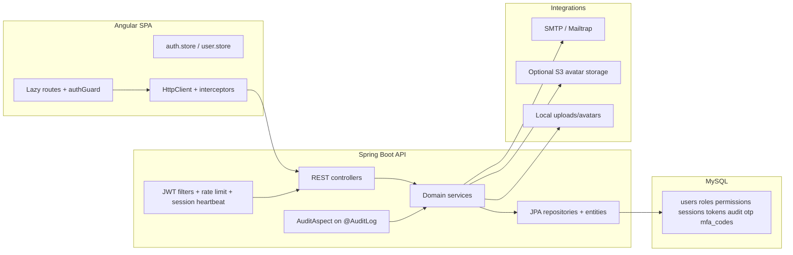
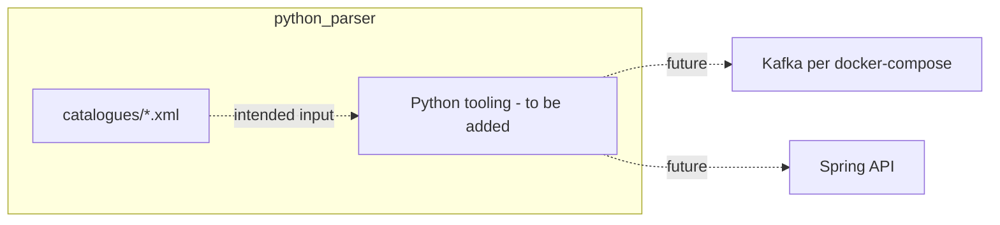
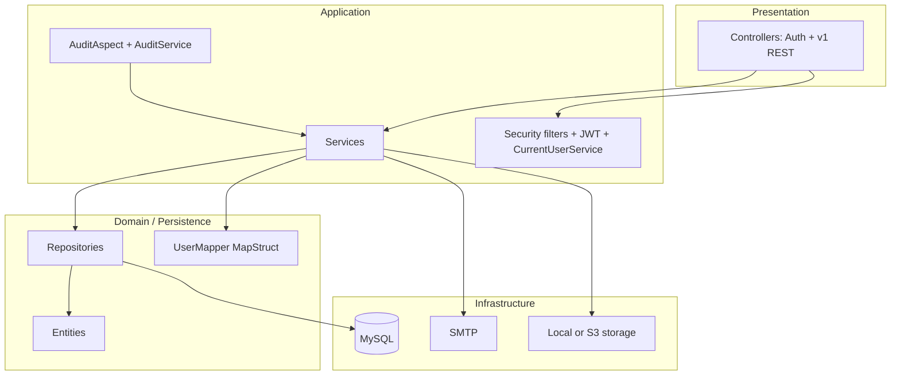
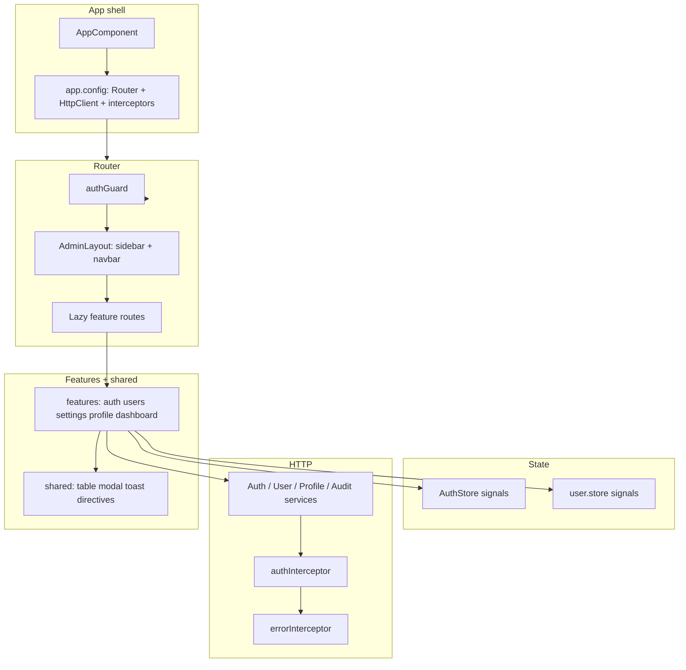

# Kpit_c — Project architecture, database, and API report

This document describes the **`Kpit_c`** workspace as analyzed from source. The workspace root contains **`backend`**, **`Frontend_angular`**, and **`python_parser`** (CAN bus XML catalogues; parser/runtime tooling may be added alongside these files). A **`docker-compose.yml`** at the repo root defines optional local **Kafka** for streaming experiments; it is **not wired** in the Java or Angular code at present.

---

## 1. Project overview

| Layer        | Stack                                                                                                                                 |
| ------------ | ------------------------------------------------------------------------------------------------------------------------------------- |
| **Backend**  | Spring Boot **3.4.1**, Java **17**, Spring Security + JWT, Spring Data JPA, MySQL, MapStruct, Lombok, SpringDoc OpenAPI, Spring Mail, Bucket4j, GoogleAuth (TOTP), AWS SDK S3 |
| **Frontend** | Angular **19**, RxJS, **@ngrx/signals**, Tailwind CSS, **lucide-angular**                                                             |
| **`python_parser`** | **CAN catalogue assets** — XML definitions for vehicle/key buses (`Car_CAN`, `Key_CAN`); folder reserved for **Python** parsing, codegen, or ingestion tools *(no `.py` sources in repo yet)* |
| **Infra (optional)** | **`docker-compose.yml`** — Apache **Kafka** broker on port **9092** (not referenced by Spring/Angular) |
| **Product name (in code/docs)** | “**Able Pro IAM**” / `user-management-platform` (Angular package name)                                                      |

**Runtime shape (IAM app):** SPA on **http://localhost:4200** talks to REST API on **http://localhost:8080**, with CORS limited to `localhost:4200` and `Authorization: Bearer` for protected calls (see `SecurityConfig` / `app.config.ts`).

**`python_parser`:** standalone data/tooling area; **no imports or API calls** from `backend` or `Frontend_angular` today (see **§ 2.6**).

---

## 2. Architecture (logical)



**Workspace extension — `python_parser`:** logical CAN/message **catalogue** files for automotive-style **CAN** buses; future Python jobs (parse XML → DBC-like structures, validation, Kafka producers, etc.) would live here. Treated as **separate** from the IAM request path until explicitly integrated.



### 2.1 Backend layering

**Typical request path:** `Controller` → `Service` → `Repository` → MySQL; DTOs + MapStruct mappers where used; exceptions centralized in `GlobalExceptionHandler`.

### 2.2 Cross-cutting concerns

- **JWT:** `JwtAuthenticationFilter` builds the security context from `Authorization: Bearer` (rejects using `mfa_auth` tokens as Bearer—they are for the MFA verify body flow).
- **Rate limiting:** `RateLimitFilter` (Bucket4j) — **5 requests / minute / IP** on `login`, `forgot-password`, `verify-otp`.
- **Session activity:** `SessionHeartbeatFilter` updates session “last active” for authenticated traffic.
- **Hardening:** `SecurityHardeningFilter` (headers / hardening—present in the chain).
- **Audit:** `@AuditLog` on selected admin mutations; `AuditAspect` writes `audit_logs` after successful method execution.

### 2.3 Frontend layering

- **Routing:** `app.routes.ts` — default `/` → `auth/login`; protected `/admin/*` with `authGuard`; lazy-loaded feature modules (auth, users, settings, profile).
- **State:** NgRx **signals** stores (`auth.store.ts`, `user.store.ts`).
- **HTTP:** `authInterceptor` attaches `access_token` from `localStorage` unless the URL matches public auth paths; `errorInterceptor` for errors.

---

## 2.4 Backend — detailed project architecture

This section describes how the Spring Boot application is **organized on disk**, how a **request flows** through filters and controllers, and how **packages depend on each other** in practice.

### 2.4.1 Root layout (`backend/`)

| Path | Role |
| ---- | ---- |
| `pom.xml` | Maven build; Spring Boot parent **3.4.1**, Java **17**, dependencies (JPA, Security, Web, Validation, AOP, JWT, MapStruct, SpringDoc, Mail, Bucket4j, GoogleAuth, AWS S3, MySQL driver, Lombok). |
| `src/main/java/com/example/backend/` | All application Java code under base package `com.example.backend`. |
| `src/main/resources/application.properties` | Datasource, JPA `ddl-auto`, JWT durations, server port, SpringDoc paths, mail, storage (`local` vs `s3`). |
| `src/main/resources/db/` | Authoritative SQL: `schema.sql`, `PRODUCTION_FINAL_SCHEMA.sql`, `migration-v1.sql`, `migration-v2.sql`. |
| `src/test/java/` | Tests (when present). |

**Entry point:** `BackendApplication` — `@SpringBootApplication`, `@EnableAsync`, `@EnableScheduling`.

### 2.4.2 Java package map

```text
com.example.backend
├── BackendApplication.java
├── audit/
│   ├── AuditAspect.java          # AOP: methods annotated with @AuditLog
│   └── AuditLog.java             # Annotation for auditable controller/service methods
├── config/
│   ├── DataInitializer.java      # CommandLineRunner seed (permissions, roles, admin/user)
│   ├── JpaConfig.java            # @EnableJpaAuditing (created_at / updated_at)
│   ├── OpenApiConfig.java        # Swagger / OpenAPI bean (title, version)
│   ├── S3Config.java             # AWS SDK client when using S3 avatars
│   ├── SecurityConfig.java       # Filter chain, CORS, PUBLIC_PATHS, 401/403 JSON handlers
│   └── WebMvcConfig.java         # Static handler for local avatar uploads
├── controller/
│   ├── AuthController.java       # /api/auth/*
│   └── v1/
│       ├── AdminHealthControllerV1.java
│       ├── AuditLogControllerV1.java
│       ├── PermissionControllerV1.java
│       ├── ProfileControllerV1.java
│       ├── RoleControllerV1.java
│       ├── SessionControllerV1.java
│       └── UserControllerV1.java
├── dto/
│   ├── auth/                     # Login, register, refresh, MFA, OTP, reset-password payloads
│   ├── common/                   # ApiError, PageResponse<T>
│   ├── permission/               # PermissionResponse (nested in user payloads)
│   ├── role/                     # RoleResponse
│   ├── user/                     # UserResponse (list view)
│   └── v1/                       # Profile, sessions, audit, RBAC admin DTOs
├── entity/                       # JPA entities (users, roles, permissions, sessions, tokens, OTP, MFA codes, audit_logs)
├── exception/
│   └── GlobalExceptionHandler.java # @RestControllerAdvice — validation, security, consistent ApiError JSON
├── mapper/
│   └── UserMapper.java           # MapStruct: UserEntity ↔ DTOs
├── repository/                 # Spring Data JPA (+ Specifications where needed)
├── security/
│   ├── CurrentUserService.java   # Resolves authenticated UUID from SecurityContext / JWT
│   ├── CustomUserDetailsService.java # Loads UserEntity by email; builds authorities
│   ├── JwtAuthenticationFilter.java  # Bearer JWT → Authentication
│   ├── JwtService.java           # Create/parse JWT (access, refresh, reset, mfa_auth)
│   ├── RateLimitFilter.java      # Bucket4j on selected auth paths
│   ├── SecurityHardeningFilter.java  # Security headers (CSP, X-Frame-Options, etc.)
│   └── SessionHeartbeatFilter.java   # Touches session last_active
├── service/                      # Transactional business logic (see 2.4.4)
└── storage/
    ├── ImageStorageService.java  # Interface
    ├── LocalStorageServiceImpl.java
    └── S3StorageServiceImpl.java
```

### 2.4.3 HTTP request lifecycle (security filter order)

For each request, Spring Security applies **`SecurityFilterChain`** (`SecurityConfig`):

1. **CSRF** disabled (stateless JWT API).
2. **CORS** — allowed origin `http://localhost:4200`; methods including `OPTIONS`; credentials allowed.
3. **`authorizeHttpRequests`**
   - `PUBLIC_PATHS` → `permitAll()` (auth endpoints that must work without JWT, plus OpenAPI/Swagger).
   - `/api/auth/**` and `/api/v1/**` → **authenticated** (JWT required except for paths already permitted above).
   - `anyRequest()` → `permitAll()` (non-`/api` routes, e.g. static resources if any).
4. **Session** — `STATELESS` (no server session for security context storage).
5. **Exception handling** — custom `AuthenticationEntryPoint` (401 JSON) and `AccessDeniedHandler` (403 JSON).
6. **`DaoAuthenticationProvider`** — used with `CustomUserDetailsService` + `BCryptPasswordEncoder` for password flows internal to Spring Security where applicable.
7. **Filters (before `UsernamePasswordAuthenticationFilter`):**
   - **`SecurityHardeningFilter`** — response headers: `X-Content-Type-Options`, `X-Frame-Options`, `X-XSS-Protection`, `Content-Security-Policy`, optional HSTS comment for HTTPS.
   - **`RateLimitFilter`** — per-IP bucket on `/api/auth/login`, `/forgot-password`, `/verify-otp` (429 JSON on exhaustion).
   - **`JwtAuthenticationFilter`** — reads `Authorization: Bearer`; validates JWT; loads `UserDetails`; sets `SecurityContext`. Skips establishing principal for `mfa_auth`-typed tokens used only in MFA body flow.
8. **`SessionHeartbeatFilter`** — runs **after** JWT filter; updates **`sessions.last_active`** for the current session when applicable.

Then the request hits **`DispatcherServlet`** → **`@RestController`** → **`@Service`** → **`Repository`**.

**Method-level security:** `@EnableMethodSecurity` allows `@PreAuthorize("hasAuthority('...')")` and `hasRole('ADMIN')` on controller methods.

### 2.4.4 Service layer responsibilities

| Service | Responsibility |
| ------- | ---------------- |
| **`AuthService`** | Login (password + optional MFA challenge), register, refresh token rotation, forgot-password / OTP / reset-password JWT flow; coordinates JWT issuance, `RefreshTokenEntity` / `SessionEntity`, and `EmailService` where needed. |
| **`UserServiceV1`** | Paginated user listing (Specification-based filtering: search, status, role, sort), user detail, profile updates, admin password change, toggle `is_active`. |
| **`RoleService`** | List roles with permissions; update role–permission mapping (admin); flat permission slug list. |
| **`SessionService`** | List sessions for a user; revoke session and linked refresh tokens. |
| **`AuditLogService`** | Paginated audit log reads with filters (`AuditLogRepository` + `AuditLogSpecification`). |
| **`AuditService`** | Low-level write to `audit_logs` (used by `AuditAspect` after successful audited operations). |
| **`OtpService`** | Generate, persist, verify OTP rows in `otp_codes` (email password reset). |
| **`MfaTotpService`** | TOTP secret generation, QR/otpauth payload, confirm MFA, disable MFA, recovery codes. |
| **`AvatarService`** | Validates upload, delegates to **`ImageStorageService`** (local or S3), updates `users.avatar_url`. |
| **`EmailService`** | Sends transactional mail (Spring `JavaMailSender`). |
| **`MailHealthService`** | Admin test email for SMTP diagnostics. |

Cross-cutting **audit**: controller methods annotated with **`@AuditLog`** trigger **`AuditAspect`**, which after successful execution calls **`AuditService`** with action/resource/resourceId, actor user id, and request metadata.

### 2.4.5 Persistence layer

| Repository | Entity | Notes |
| ---------- | ------ | ----- |
| `UserRepository` | `UserEntity` | `JpaSpecificationExecutor` for dynamic list filters |
| `RoleRepository` | `RoleEntity` | |
| `PermissionRepository` | `PermissionEntity` | |
| `SessionRepository` | `SessionEntity` | |
| `RefreshTokenRepository` | `RefreshTokenEntity` | |
| `OtpCodeRepository` | `OtpCodeEntity` | |
| `MfaRecoveryCodeRepository` | `MfaRecoveryCodeEntity` | |
| `AuditLogRepository` | `AuditLogEntity` | `JpaSpecificationExecutor` + `AuditLogSpecification` |

**Entity design notes:**

- **`AbstractAuditingEntity`** — `created_at`, `updated_at` via Spring Data JPA auditing (`JpaConfig`).
- **`UserEntity`** — `@SQLRestriction("deleted_at IS NULL")` for default visibility; many-to-many to roles via `user_roles`.
- **UUID as `BINARY(16)`** — column definition on entities matches MySQL schema.

### 2.4.6 API surface vs DTO layout

- **`dto/auth`** — inbound/outbound for unauthenticated or token-oriented flows: `LoginRequest`, `RegisterRequest`, `RefreshTokenRequest`, `ForgotPasswordRequest`, `VerifyOtpRequest`, `VerifyOtpResponse`, `ResetPasswordRequest`, `MfaVerifyRequest`, `MfaAuthResponse`, `AuthResponse`.
- **`dto/common`** — `ApiError` (aligns with Angular `errorInterceptor`), `PageResponse<T>` for pagination.
- **`dto/user`** — `UserResponse` (list rows).
- **`dto/v1`** — admin/self-service V1: `UserDetailResponse`, `UserProfileUpdateRequest`, `PasswordChangeRequest`, `SelfPasswordChangeRequest`, MFA DTOs, `SessionResponse`, `AuditLogResponse`, role/permission admin DTOs.
- **`dto/role`**, **`dto/permission`** — shapes embedded in auth/user responses.

**Mapping:** `UserMapper` (MapStruct) converts entities to response DTOs; Lombok reduces boilerplate on entities/DTOs.

### 2.4.7 Integrations and configuration

- **MySQL** — JDBC URL and credentials from `application.properties` (use env overrides in prod).
- **JWT** — signed with HMAC (`jjwt`); claim `type` distinguishes access / refresh / reset / mfa_auth; access token may carry `sessionId`.
- **Mail** — SMTP via Spring Mail (`EmailService`, `MailHealthService`).
- **Avatars** — `app.storage.type`: **`LocalStorageServiceImpl`** (files under `app.upload.dir`, served via `WebMvcConfig`) or **`S3StorageServiceImpl`** (`S3Config` + bucket/region/keys).
- **Documentation** — SpringDoc OpenAPI + Swagger UI paths configured in `application.properties`; **`OpenApiConfig`** customizes API metadata.

### 2.4.8 Backend architecture diagram (layered)



---

## 2.5 Frontend — detailed project architecture

This section describes the **Angular 19** SPA: folder structure, **standalone** components, **routing**, **state**, and how **features** consume **core** services.

### 2.5.1 Root layout (`Frontend_angular/`)

| Path | Role |
| ---- | ---- |
| `package.json` | `user-management-platform`; Angular **19**, RxJS 7.8, **@ngrx/signals**, Tailwind 3.4, lucide-angular. |
| `angular.json` / `tsconfig.*` | CLI build, TypeScript config. |
| `src/index.html`, `src/main.ts` | Bootstrap; typically `bootstrapApplication(AppComponent, appConfig)`. |
| `src/styles.*` / `tailwind.config.*` | Global styles + Tailwind. |
| `src/app/` | All application logic (see below). |

### 2.5.2 `src/app/` directory map

```text
src/app/
├── app.component.ts              # Root shell
├── app.config.ts                 # provideRouter, provideHttpClient + interceptors
├── app.routes.ts                 # Top-level routes: auth, admin layout, wildcards
├── core/                         # Singleton services, guards, interceptors, API config
│   ├── auth/
│   │   └── auth.guard.ts       # CanActivateFn: token + isActive check
│   ├── config/
│   │   └── api.config.ts       # API_BASE_URL
│   ├── interceptors/
│   │   └── error.interceptor.ts
│   └── services/
│       ├── auth.service.ts
│       ├── user.service.ts
│       ├── profile.service.ts
│       ├── audit.service.ts
│       ├── breadcrumb.service.ts
│       ├── toast.service.ts
│       └── mfa-state.service.ts
├── data/                         # Types and models shared by UI
│   ├── models/                 # auth.model, user.model, role, permission, audit-log
│   └── types/                  # api.types (ApiError), filter.types
├── features/                     # Lazy route feature areas (standalone components)
│   ├── auth/                   # login, sign-up, forgot-password, code-verification, mfa-verify, reset-password + auth.routes.ts
│   ├── dashboard/
│   ├── users/                  # user-list, user-edit-drawer + users.routes.ts
│   ├── settings/               # audit-log, security-center (MFA + sessions) + settings.routes.ts
│   └── profile/                # profile-settings + profile.routes.ts
├── layouts/
│   └── admin-layout/           # Sidebar + navbar + router-outlet for /admin/*
├── shared/                       # Reusable UI (not domain-specific)
│   ├── components/             # data-table, modal, toast, skeleton, breadcrumb
│   ├── directives/             # has-permission.directive.ts
│   └── layout/                 # navbar, sidebar
└── store/
    ├── auth.store.ts           # NgRx signal store: user, tokens, permissions
    ├── user.store.ts           # Domain/user list state (if used by user feature)
    └── index.ts
```

### 2.5.3 Application bootstrap and HTTP pipeline

**`app.config.ts`**

- **`provideZoneChangeDetection`** with `eventCoalescing`.
- **`provideRouter(appRoutes)`** — file-based routing from `app.routes.ts`.
- **`provideHttpClient(withInterceptors([authInterceptor, errorInterceptor]))`**:
  - **`authInterceptor`** — for requests whose URL does **not** match public auth paths, adds `Authorization: Bearer ${localStorage access_token}`.
  - **`errorInterceptor`** — maps HTTP errors to **`ToastService`**; understands backend **`ApiError`** shape (`message`, `errors` map for 422 validation).

Public auth URL substrings are aligned with backend: login, register, refresh, forgot-password, verify-otp, reset-password, mfa/verify.

### 2.5.4 Routing architecture

**Top level (`app.routes.ts`):**

| Path | Behavior |
| ---- | -------- |
| `''` | Redirect to `auth/login`. |
| `auth/*` | Lazy `features/auth/auth.routes.ts` — public auth flows. |
| `admin/*` | **`canActivate: [authGuard]`**; lazy **`AdminLayoutComponent`**; child routes for dashboard, users, settings, profile. |
| `**` | Redirect to `auth/login`. |

**Lazy children**

- **`features/auth/auth.routes.ts`** — login, register, forgot-password, verify-code, mfa-verify, reset-password.
- **`features/users/users.routes.ts`** — list (and edit UX via drawer).
- **`features/settings/settings.routes.ts`** — defaults to audit; `security` for Security Center.
- **`features/profile/profile.routes.ts`** — profile settings page.

`AdminLayoutComponent` provides a **shell**: `SidebarComponent` + `NavbarComponent` + `<router-outlet>` for feature content — consistent chrome for authenticated app.

### 2.5.5 State management (NgRx Signals)

**`AuthStore`** (`store/auth.store.ts`)

- **State:** `user`, `accessToken`, `refreshToken`, `isAuthenticated`, `permissions` (string slugs).
- **Hydration:** on init, reads `localStorage` keys `access_token`, `refresh_token`, `auth_user`, `auth_permissions` so refresh keeps session.
- **Methods:** `setAuth`, `hasPermission(slug)`, `logout` (clears storage + patchState).
- **Computed:** `permissionSlugs`, `currentUser`, `loggedIn`.

**`user.store.ts`** — supplementary state for user listing / selection patterns used by the users feature (signal store pattern consistent with auth).

**RBAC in templates:** **`HasPermissionDirective`** (`*appHasPermission="'user:write'"`) uses `AuthStore.hasPermission` and `effect()` to create/destroy embedded views.

### 2.5.6 Feature modules and UI patterns

| Feature | Components / behavior |
| ------- | ---------------------- |
| **Auth** | Forms call **`AuthService`**; login handles **200 vs 202** (MFA); **`MfaStateService`** can hold interim MFA token; code verification and reset-password align with OTP/reset JWT backend flow. |
| **Users** | **`UserService`** lists/filters users via query params matching backend; **`data-table`** + **`user-edit-drawer`** for table + side panel editing; permission checks for admin vs read-only UX. |
| **Settings / Audit** | **`AuditService`** reads paginated audit logs; table UI with filters. |
| **Settings / Security** | **`SecurityCenterComponent`** composes **MFA enrollment** and **active-sessions**; calls profile/MFA/session APIs via **`ProfileService`** or dedicated HTTP in components. |
| **Profile** | **`ProfileService`** + **`ProfileSettingsComponent`** for self-service profile and avatar upload (`multipart/form-data`). |
| **Dashboard** | Entry landing under `/admin`. |

**Shared UI:** **`data-table`** (column config interface), **`modal`**, **`toast`**, **`skeleton`** loaders, **`breadcrumb`** + **`BreadcrumbService`**.

### 2.5.7 Data models

Under **`data/models/`** — TypeScript interfaces mirroring API payloads: **`User`**, **`AuthResponse`**, **`MfaAuthResponse`**, **`Role`**, **`Permission`**, **`AuditLog`**.  
**`data/types/api.types.ts`** — `ApiError` for interceptor typing.

### 2.5.8 Auth guard and inactive users

**`authGuard`** (`core/auth/auth.guard.ts`)

1. If not authenticated → navigate to `/auth/login`.
2. If `user.isActive === false` → **`authStore.logout()`** and redirect with `queryParams: { reason: 'disabled' }` (disabled accounts must not use the app even with a token).

### 2.5.9 Frontend architecture diagram



### 2.5.10 Styling and UX

- **Tailwind CSS** utility classes across layouts and features (`AdminLayoutComponent` uses flex layout and gray background pattern).
- **Lucide Angular** for icons in navigation and actions.
- **OnPush** change detection where components opt in (e.g. `AdminLayoutComponent`) for performance.

---

## 2.6 `python_parser` — CAN catalogue layout and intended architecture

The **`python_parser/`** directory is a **workspace component** for **Controller Area Network (CAN)** message/signal definitions and (by name) **Python-based parsing or pipeline code**. As of the current tree, it contains **only XML catalogue files** under `catalogues/`; there are **no** `requirements.txt`, `pyproject.toml`, or `.py` modules yet.

### 2.6.1 Directory layout

```text
python_parser/
└── catalogues/
    ├── car_can.xml    # Bus Name="Car_CAN"
    └── key_can.xml    # Bus Name="Key_CAN"
```

### 2.6.2 XML catalogue model (conceptual schema)

The files follow the same **informal XML vocabulary** (not XSD-validated in-repo):

| Element / attribute | Meaning |
| ------------------- | ------- |
| **`<Bus Name="…">`** | Logical CAN bus identifier (e.g. `Car_CAN`, `Key_CAN`). |
| **`<massage name="…" id="0x…">`** | Message/frame name and **hex CAN ID** *(tag name appears as “massage”, likely typo for “message”)*. |
| **`<sender>` / `<reciver>`** | Endpoints (e.g. raspberry Master/slave) *(“reciver” spelling as in source)*. |
| **`<Cyclic>`** | Periodic transmission: `status`, optional `cycle` (e.g. ms). |
| **`<Event>`** | Event-driven: `status`, optional `Repetion`, `Timing`. |
| **`<Byte><Num>`** | Byte index within the payload. |
| **`<Signal Bit="…">`** | Bit mask pattern (`x` = don’t care, `0`/`1` = fixed bits) describing signal layout within the byte(s). |
| **`<signal_name>`** | Human-readable signal id. |
| **`<values>`** | Enumerated **value** / **name** pairs (or ranges expressed as text e.g. `0...4.294967295E9` for wide fields). |

**Example buses in repo:**

- **`car_can.xml`** — `Car_Status` @ `0x2FC`, door/latch/selective unlock signals, cyclic/event timing, multi-byte layout.
- **`key_can.xml`** — `key_comm` @ `0x723`, key position/buttons, multi-byte `Key_ID` fields.

### 2.6.3 Intended role in a larger architecture

A typical evolution (not yet implemented in this repo) would be:

1. **Parse** `catalogues/*.xml` with Python (`xml.etree`, `lxml`, or code generation) into structured objects or **DBC**-like outputs.
2. **Validate** bit layouts and enumerate sets against OEM rules.
3. **Optional:** publish decoded frames to **Kafka** (matches optional **`docker-compose.yml`** broker on `localhost:9092`).
4. **Optional:** expose decoded telemetry via **Spring Boot** REST or persist snapshots — would require new **controllers/services** and explicit integration points.

### 2.6.4 Integration status (current)

| Consumer | References `python_parser`? |
| -------- | --------------------------- |
| **Spring Boot `backend`** | **No** — no classpath or path references to these XML files. |
| **Angular `Frontend_angular`** | **No**. |
| **CI / Docker Compose** | **Kafka only** at repo root; no service mounts `python_parser`. |

Treat **`python_parser`** as an **independent asset folder** until Python modules and integration contracts are added.

---

## 3. Database schemas (detailed)

There are **two canonical SQL baselines** in the repo:

1. **`backend/src/main/resources/db/schema.sql`** — database name **`able_pro_iam`**.
2. **`backend/src/main/resources/db/PRODUCTION_FINAL_SCHEMA.sql`** — database name **`smart_real_time_analyser`** (adds an index on `roles.name`); table definitions align with the app.

**Important inconsistency:** `application.properties` points the datasource at **`smart_real_time_analyser`** with **`spring.jpa.hibernate.ddl-auto=update`**, so Hibernate can evolve schema against that DB name while hand-written SQL files mention **`able_pro_iam`** or **`smart_real_time_analyser`**. Treat **`PRODUCTION_FINAL_SCHEMA.sql`** + **`migration-v1.sql` / `migration-v2.sql`** as documentation of incremental changes.

### 3.1 `users`

| Column          | Type              | Notes                                      |
| --------------- | ----------------- | ------------------------------------------ |
| `id`            | `BINARY(16)` PK   | UUID                                       |
| `email`         | `VARCHAR(255)`    | UNIQUE                                     |
| `username`      | `VARCHAR(100)`    | UNIQUE                                     |
| `password_hash` | `VARCHAR(255)`    | BCrypt in app                              |
| `full_name`     | `VARCHAR(255)`    |                                            |
| `job_title`     | `VARCHAR(100)`    |                                            |
| `department`    | `VARCHAR(100)`    |                                            |
| `timezone`      | `VARCHAR(50)`     | default `'UTC'`                            |
| `phone`         | `VARCHAR(50)`     |                                            |
| `bio`           | `TEXT`            |                                            |
| `avatar_url`    | `VARCHAR(500)`    | Local path or S3 URL                       |
| `mfa_secret`    | `VARCHAR(255)`    | TOTP secret when configured                |
| `is_active`     | `TINYINT(1)`      | default 1 — account enabled/disabled       |
| `mfa_enabled`   | `TINYINT(1)`      | default 0                                  |
| `verified`      | `TINYINT(1)`      | default 0 — email/verification flag        |
| `created_at`    | `DATETIME(6)`     |                                            |
| `updated_at`    | `DATETIME(6)`     |                                            |
| `deleted_at`    | `DATETIME(6)` NULL| **Soft delete**                            |

**Indexes / constraints (from schema):** `uk_users_email`, `uk_users_username`, `idx_users_is_active`, `idx_users_created_at`, `idx_users_deleted_at`.

**JPA:** `UserEntity` uses `@SQLRestriction("deleted_at IS NULL")` so soft-deleted rows are hidden from normal queries. `@PrePersist` assigns UUID if null.

### 3.2 `roles`

| Column        | Type             | Notes                                                |
| ------------- | ---------------- | ---------------------------------------------------- |
| `id`          | `BINARY(16)` PK  |                                                      |
| `name`        | `VARCHAR(100)`   | UNIQUE — e.g. `Admin` → `ROLE_ADMIN` in Spring       |
| `description` | `VARCHAR(500)` |                                                      |
| `created_at`  | `DATETIME(6)`    |                                                      |
| `updated_at`  | `DATETIME(6)`    |                                                      |

**Indexes:** `uk_roles_name`; production schema may add `idx_roles_name`.

### 3.3 `permissions`

| Column        | Type             | Notes                         |
| ------------- | ---------------- | ----------------------------- |
| `id`          | `BINARY(16)` PK  |                               |
| `slug`        | `VARCHAR(100)`   | UNIQUE — e.g. `user:read`, `audit:view` |
| `description` | `VARCHAR(500)`   |                               |
| `created_at`  | `DATETIME(6)`    |                               |
| `updated_at`  | `DATETIME(6)`    |                               |

**Indexes:** `uk_permissions_slug`, `idx_permissions_slug`.

### 3.4 `user_roles`

- Composite PK (`user_id`, `role_id`)
- FKs to `users` / `roles`, `ON DELETE CASCADE`
- `created_at` `DATETIME(6)`

### 3.5 `role_permissions`

- Composite PK (`role_id`, `permission_id`)
- FKs to `roles` / `permissions`, `ON DELETE CASCADE`
- `created_at` `DATETIME(6)`

### 3.6 `audit_logs`

| Column        | Type                          | Notes                                      |
| ------------- | ----------------------------- | ------------------------------------------ |
| `id`          | `BINARY(16)` PK               |                                            |
| `user_id`     | `BINARY(16)` NULL             | FK `SET NULL` on user delete               |
| `action`      | `VARCHAR(100)` NOT NULL       | e.g. `USER_UPDATE`                         |
| `resource`    | `VARCHAR(100)` NOT NULL       | e.g. `users`                              |
| `resource_id` | `VARCHAR(36)` NULL          |                                            |
| `metadata`    | `JSON` NULL                   |                                            |
| `ip_address`  | `VARCHAR(45)` NULL           |                                            |
| `user_agent`  | `VARCHAR(500)` NULL          |                                            |
| `source`      | `ENUM('audit','security')`    | NOT NULL, default `audit`                  |
| `created_at`  | `DATETIME(6)` NOT NULL       |                                            |

**Indexes:** `idx_audit_logs_user_id`, `idx_audit_logs_action`, `idx_audit_logs_resource`, `idx_audit_logs_created_at`.

**JPA:** `AuditLogEntity` maps `source` to enum `AuditSource` (`audit`, `security`).

### 3.7 `sessions`

| Column        | Type             | Notes                                      |
| ------------- | ---------------- | ------------------------------------------ |
| `id`          | `BINARY(16)` PK  |                                            |
| `user_id`     | `BINARY(16)` NOT NULL | FK CASCADE                            |
| `device`      | `VARCHAR(255)` NULL |                                        |
| `ip_address`  | `VARCHAR(45)` NULL |                                         |
| `user_agent`  | `VARCHAR(500)` NULL |                                        |
| `last_active` | `DATETIME(6)`    | default `CURRENT_TIMESTAMP(6)`             |
| `created_at`  | `DATETIME(6)`    |                                            |

**Indexes:** `idx_sessions_user_id`, `idx_sessions_last_active`.

Used for “Security Center” active devices and JWT `sessionId` claim linkage.

### 3.8 `mfa_recovery_codes`

| Column      | Type              | Notes                    |
| ----------- | ----------------- | ------------------------ |
| `id`        | `BINARY(16)` PK   |                          |
| `user_id`   | `BINARY(16)` NOT NULL | FK CASCADE           |
| `code_hash` | `VARCHAR(255)` NOT NULL | Hashed backup code |
| `used_at`   | `DATETIME(6)` NULL | One-time use          |
| `created_at`| `DATETIME(6)`     |                          |

**Index:** `idx_mfa_recovery_codes_user_id`.

### 3.9 `otp_codes`

| Column       | Type             | Notes                                      |
| ------------ | ---------------- | ------------------------------------------ |
| `id`         | `BINARY(16)` PK  |                                            |
| `email`      | `VARCHAR(255)` NOT NULL |                                     |
| `code`       | `VARCHAR(6)` NOT NULL |                                          |
| `expires_at` | `DATETIME(6)` NOT NULL | (*schema comment: ~5 min expiry*)       |
| `used_at`    | `DATETIME(6)` NULL |                                            |
| `created_at` | `DATETIME(6)` NOT NULL |                                         |

**Indexes:** `idx_otp_codes_email`, `idx_otp_codes_expires_at`.

### 3.10 `refresh_tokens`

| Column        | Type              | Notes                                      |
| ------------- | ----------------- | ------------------------------------------ |
| `id`          | `BINARY(16)` PK   |                                            |
| `user_id`     | `BINARY(16)` NOT NULL | FK CASCADE                             |
| `session_id`  | `BINARY(16)` NULL | FK `sessions` CASCADE *(migrations add this)* |
| `token_hash`  | `VARCHAR(255)` NOT NULL | UNIQUE                         |
| `device`      | `VARCHAR(255)` NULL |                                            |
| `ip_address`  | `VARCHAR(45)` NULL |                                             |
| `user_agent`  | `VARCHAR(500)` NULL |                                            |
| `expires_at`  | `DATETIME(6)` NOT NULL |                                          |
| `revoked_at`  | `DATETIME(6)` NULL |                                             |
| `created_at`  | `DATETIME(6)` NOT NULL |                                            |

**Indexes:** `uk_refresh_tokens_token_hash`, `idx_refresh_tokens_user_id`, `idx_refresh_tokens_expires_at`.

**Migrations:** `migration-v1.sql` / `migration-v2.sql` add columns/tables for MFA recovery, OTP, and `refresh_tokens.session_id` for environments that predate the unified schema file.

### 3.11 Seed data (`DataInitializer`)

On startup (non-`test` profile), idempotent seed:

- **Permissions:** `user:read`, `user:write`, `user:create`, `audit:view`, `billing:view`
- **Roles:** **Admin** (all seeded permissions), **User** (`user:read` only)
- **Users:**
  - `admin@ablepro.com` / `Admin123!` (Admin role)
  - `user@ablepro.com` / `User123!` (User role)

`billing:view` is seeded but **no API or Angular feature references it** in application source (placeholder for future billing UI). *(A grep over `*.java`, `*.ts`, `*.html` under the project shows `billing` only in `DataInitializer` and unrelated `node_modules` typings.)*

---

## 4. APIs (REST)

Base URL: **`/api`**. Public auth endpoints are **permitAll**; **`/api/auth/*` not in the public list** and all **`/api/v1/*`** require authentication (JWT).

**Public paths (from `SecurityConfig`):**

- `/api/auth/login`
- `/api/auth/register`
- `/api/auth/refresh`
- `/api/auth/verify-otp`
- `/api/auth/forgot-password`
- `/api/auth/reset-password`
- `/api/auth/mfa/verify`
- `/v3/api-docs/**`
- `/swagger-ui/**`
- `/swagger-ui.html`

### 4.1 Authentication — `AuthController` (`/api/auth`)

| Method | Path                 | Body (summary)                    | Response                                              | Notes              |
| ------ | -------------------- | --------------------------------- | ----------------------------------------------------- | ------------------ |
| POST   | `/login`             | `{ email, password }`             | **200** `AuthResponse` or **202** `MfaAuthResponse` (`mfaToken`) | Rate limited       |
| POST   | `/mfa/verify`        | `{ mfaToken, code }`              | `AuthResponse`                                        | Public             |
| POST   | `/register`          | `{ name, email, password }`       | `AuthResponse`                                        | Public             |
| POST   | `/refresh`           | `{ refreshToken }`               | `AuthResponse`                                        | Public             |
| POST   | `/forgot-password`   | `{ email }`                       | 200 OK empty body                                     | Rate limited; email OTP |
| POST   | `/verify-otp`        | `{ email, code }`                 | `VerifyOtpResponse` (`resetToken`, expiry)            | Rate limited       |
| POST   | `/reset-password`    | `{ resetToken, newPassword }`    | 200 OK empty body                                     | Uses JWT type `reset`   |

### 4.1.1 JWT timings (`application.properties`)

- **Access token:** `app.jwt.access-token-expiration-ms` = **900000 ms** (15 min)
- **Refresh token:** `app.jwt.refresh-token-expiration-ms` = **604800000 ms** (7 days)
- **Reset token:** `app.jwt.reset-token-expiration-ms` = **900000 ms** (15 min)
- **MFA pending auth token:** `app.jwt.mfa-auth-token-expiration-ms` = **300000 ms** (5 min)

Access tokens can include **`sessionId`** when session tracking is used (`JwtService.generateAccessToken`).

### 4.2 Users — `UserControllerV1` (`/api/v1/users`)

| Method | Path              | Query / body                                                                 | Authorization                          |
| ------ | ----------------- | ----------------------------------------------------------------------------- | -------------------------------------- |
| GET    | `/`               | `search`, `status` (default `all`), `roleId`, `sortBy` (default `created_at`), `sortDirection` (default `desc`), `page` (default 1), `size` (default 10) | `user:read` **or** `ROLE_ADMIN`        |
| GET    | `/{id}`           | —                                                                             | same                                   |
| PUT    | `/{id}`           | `UserProfileUpdateRequest` (profile fields)                                   | `user:write` **or** `ROLE_ADMIN` + audit |
| PATCH  | `/{id}/status`    | —                                                                             | same                                   |
| PATCH  | `/{id}/password`  | `PasswordChangeRequest` (admin-style change)                                  | same                                   |

### 4.3 Profile (self-service) — `ProfileControllerV1` (`/api/v1/profile`)

| Method | Path                 | Notes                                                    |
| ------ | -------------------- | -------------------------------------------------------- |
| GET    | `/me`                | Current user detail                                      |
| PUT    | `/me`                | Update own profile                                       |
| PATCH  | `/me/password`       | `SelfPasswordChangeRequest`                              |
| POST   | `/me/mfa/enable`     | Returns secret + otpauth URL / QR payload               |
| POST   | `/me/mfa/confirm`    | First TOTP code; returns backup codes                    |
| POST   | `/me/mfa/disable`    | Requires password                                        |
| GET    | `/me/sessions`       | Active sessions list                                     |
| POST   | `/me/avatar`         | `multipart/form-data` field `file` → `{ avatarUrl }`     |

### 4.4 RBAC — roles and permissions

| Method | Path                               | Authorization                    |
| ------ | ---------------------------------- | -------------------------------- |
| GET    | `/api/v1/roles`                    | `user:read` or `ROLE_ADMIN`      |
| PUT    | `/api/v1/roles/{id}/permissions`   | **`ROLE_ADMIN` only** + audit    |
| GET    | `/api/v1/permissions`              | `user:read` or `ROLE_ADMIN`      |

### 4.5 Audit logs — `AuditLogControllerV1`

| Method | Path                   | Query                                                      | Authorization                         |
| ------ | ---------------------- | ---------------------------------------------------------- | ------------------------------------- |
| GET    | `/api/v1/audit-logs`   | `page` (default 0), `size` (default 20), `action`, `userId`  | `ROLE_ADMIN` or `audit:view`          |

**Pagination convention note:** user list defaults to **page 1**; audit logs default to **page 0** — different conventions between endpoints.

### 4.6 Sessions — `SessionControllerV1`

| Method | Path                    | Behavior                                                                 |
| ------ | ----------------------- | ------------------------------------------------------------------------ |
| DELETE | `/api/v1/sessions/{id}` | **204 No Content** — revoke session (own session or admin); invalidates linked refresh token |

### 4.7 Admin health — `AdminHealthControllerV1`

| Method | Path                           | Authorization   |
| ------ | ------------------------------ | --------------- |
| GET    | `/api/v1/admin/health/mail`    | `ROLE_ADMIN` — sends test email via `MailHealthService` |

### 4.8 Docs and static assets

- **OpenAPI JSON:** `/v3/api-docs/**` (see `springdoc.api-docs.path`)
- **Swagger UI:** `/swagger-ui/**`, `/swagger-ui.html` (see `springdoc.swagger-ui.path`)
- **Local avatars:** `/uploads/avatars/**` mapped from `app.upload.dir` via `WebMvcConfig`

### 4.9 Authorization model (Spring Security)

- **`CustomUserDetailsService`** loads user by email; inactive users throw `UsernameNotFoundException` / treated as disabled.
- **Authorities:** every permission slug on the user’s roles becomes a `SimpleGrantedAuthority`; each role name becomes `ROLE_<NAME>` with spaces → underscores and uppercased (e.g. `Admin` → `ROLE_ADMIN`).
- **`@PreAuthorize`** on controllers enforces `hasAuthority('...')` and/or `hasRole('ADMIN')` as documented above.

### 4.10 Rate limiting (Bucket4j)

From `RateLimitFilter`: **5 attempts per minute per IP** on:

- `/api/auth/login`
- `/api/auth/forgot-password`
- `/api/auth/verify-otp`

---

## 5. Features (product capabilities)

### 5.1 Identity and access

- Register, login, JWT access + refresh, token refresh endpoint
- **RBAC:** roles, permission slugs on JWT principal
- **Method security:** `@PreAuthorize` on controllers
- Account **active/inactive** toggle; soft-delete model on users

### 5.2 MFA

- TOTP (Google Authenticator–compatible) enable/confirm/disable
- Backup recovery codes stored hashed in `mfa_recovery_codes`
- Login returns **202 + mfaToken** when MFA required; Angular `mfa-verify` route

### 5.3 Password recovery

- Forgot password → email OTP (`otp_codes`)
- Verify OTP → short-lived **reset JWT**
- Reset password with reset token

### 5.4 User and profile management

- Admin user list: search, status, role filter, sorting, pagination
- User detail; admin can update profile, toggle status, change password
- Self-service profile + password change
- **Avatar upload** — local disk or **S3** via `app.storage.type`

### 5.5 Security center (UI)

- Active sessions list; revoke session (DELETE)
- MFA enrollment flow

### 5.6 Audit and compliance

- Paginated audit log UI + API
- Automatic audit records for specific mutating endpoints via `@AuditLog` and `AuditAspect`

### 5.7 Hardening and operations

- Rate limiting on sensitive auth routes
- CORS locked to dev origin (`http://localhost:4200` in `SecurityConfig`)
- Optional SMTP health check for admins

---

## 6. Frontend feature map (routes)

For the full Angular folder layout, routing tree, stores, interceptors, and diagrams, see **§ 2.5**.

| Area      | Path                                                                      | Components / notes                          |
| --------- | ------------------------------------------------------------------------- | ------------------------------------------- |
| Auth      | `/auth/login`, `register`, `forgot-password`, `verify-code`, `mfa-verify`, `reset-password` | Lazy-loaded auth feature (`auth.routes.ts`) |
| Dashboard | `/admin`                                                                  | `DashboardComponent`                        |
| Users     | `/admin/users/list`                                                       | List + edit drawer                          |
| Settings  | `/admin/settings/audit`, `security`                                       | Audit log, security center (sessions + MFA) |
| Profile   | `/admin/profile`                                                          | Profile settings                            |

**Root routing (`app.routes.ts`):** `''` → `auth/login`; `admin` layout with `authGuard`; wildcard `**` → `auth/login`.

**API base (`Frontend_angular/src/app/core/config/api.config.ts`):** `API_BASE_URL = 'http://localhost:8080'`.

**HTTP interceptors (`app.config.ts`):** public paths skip Bearer attachment:

- `/api/auth/login`
- `/api/auth/register`
- `/api/auth/refresh`
- `/api/auth/forgot-password`
- `/api/auth/verify-otp`
- `/api/auth/reset-password`
- `/api/auth/mfa/verify`

Other requests attach `Authorization: Bearer <access_token>` from `localStorage` key `access_token`.

---

## 7. Backend module reference (major components)

This is a compact index. For the full Java package tree, HTTP lifecycle, filters, repositories, and DTO map, see **§ 2.4**.

- **Controllers:** `AuthController`; `v1`: `UserControllerV1`, `ProfileControllerV1`, `RoleControllerV1`, `PermissionControllerV1`, `AuditLogControllerV1`, `SessionControllerV1`, `AdminHealthControllerV1`
- **Services (non-exhaustive):** `AuthService`, `UserServiceV1`, `SessionService`, `AuditLogService`, `AuditService`, `RoleService`, `OtpService`, `MfaTotpService`, `AvatarService`, `EmailService`, `MailHealthService`
- **Security:** `JwtService`, `JwtAuthenticationFilter`, `CustomUserDetailsService`, `CurrentUserService`, `RateLimitFilter`, `SecurityHardeningFilter`, `SessionHeartbeatFilter`
- **Storage:** `ImageStorageService` with `LocalStorageServiceImpl` / `S3StorageServiceImpl`; `S3Config`; `WebMvcConfig` for static file serving
- **Audit:** `@AuditLog` annotation, `AuditAspect`, `AuditLogEntity`
- **Entities:** `UserEntity`, `RoleEntity`, `PermissionEntity`, `SessionEntity`, `RefreshTokenEntity`, `OtpCodeEntity`, `MfaRecoveryCodeEntity`, `AuditLogEntity`, `AbstractAuditingEntity`
- **JPA:** `JpaConfig` with `@EnableJpaAuditing` for `created_at` / `updated_at` on `AbstractAuditingEntity`

---

## 8. Configuration and security notes (operators)

- **Secrets in repo risk:** `application.properties` may contain default DB password, JWT secret placeholder, and Mail SMTP credentials. For production, use environment variables only: e.g. `DB_PASSWORD`, `JWT_SECRET`, `MAIL_HOST`, `MAIL_USERNAME`, `MAIL_PASSWORD`, `MAIL_FROM`, `STORAGE_TYPE`, S3-related vars.
- **Database name:** align MySQL database name with `spring.datasource.url` and the SQL baseline you apply (`able_pro_iam` vs `smart_real_time_analyser`).
- **Storage:** `app.storage.type=${STORAGE_TYPE:local}` — `local` or `s3`; S3 requires bucket, region, and credentials per `application.properties` comments.
- **JWT secret:** comments require minimum 32 characters in production (`app.jwt.secret`).

---

## 9. Source files cited in this report (non-exhaustive)

| Purpose              | Path |
| -------------------- | ---- |
| This report (full)   | `PROJECT_ARCHITECTURE_REPORT.md` |
| CAN catalogues (Car_CAN) | `python_parser/catalogues/car_can.xml` |
| CAN catalogues (Key_CAN) | `python_parser/catalogues/key_can.xml` |
| Optional Kafka (Compose) | `docker-compose.yml` |
| SQL schema (dev name)| `backend/src/main/resources/db/schema.sql` |
| SQL schema (prod name) | `backend/src/main/resources/db/PRODUCTION_FINAL_SCHEMA.sql` |
| Migrations           | `backend/src/main/resources/db/migration-v1.sql`, `migration-v2.sql` |
| Datasource / JWT / mail / storage | `backend/src/main/resources/application.properties` |
| Security             | `backend/src/main/java/com/example/backend/config/SecurityConfig.java` |
| Seed data            | `backend/src/main/java/com/example/backend/config/DataInitializer.java` |
| Auth API             | `backend/src/main/java/com/example/backend/controller/AuthController.java` |
| JWT claims / expiry  | `backend/src/main/java/com/example/backend/security/JwtService.java` |
| User entity          | `backend/src/main/java/com/example/backend/entity/UserEntity.java` |
| User details / roles | `backend/src/main/java/com/example/backend/security/CustomUserDetailsService.java` |
| Angular routes       | `Frontend_angular/src/app/app.routes.ts` |
| Angular auth API     | `Frontend_angular/src/app/core/services/auth.service.ts` |
| Angular HTTP         | `Frontend_angular/src/app/app.config.ts` |
| API base URL         | `Frontend_angular/src/app/core/config/api.config.ts` |
| Maven / dependencies | `backend/pom.xml` |
| NPM / Angular version| `Frontend_angular/package.json` |

---

*End of report.*
