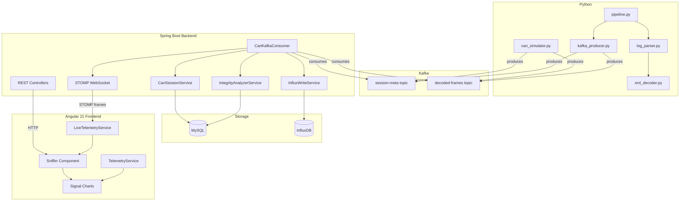
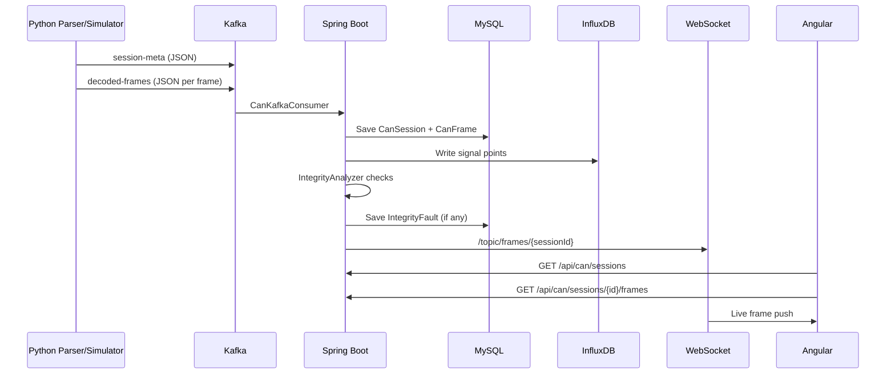
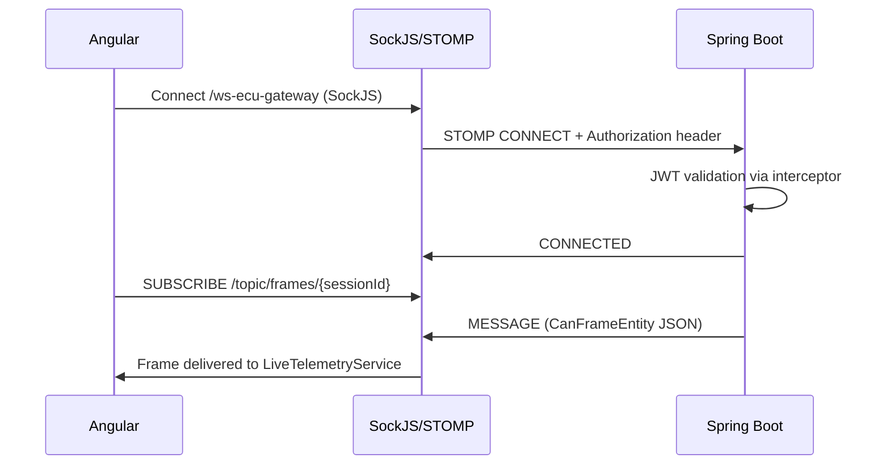
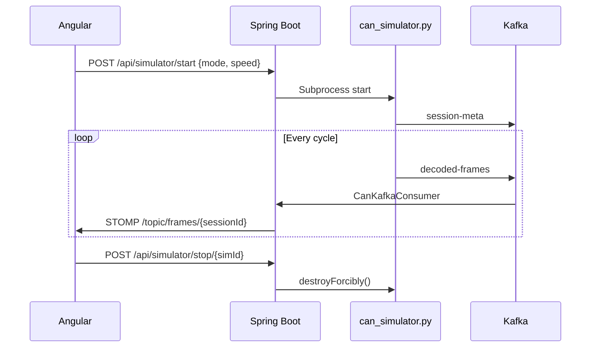
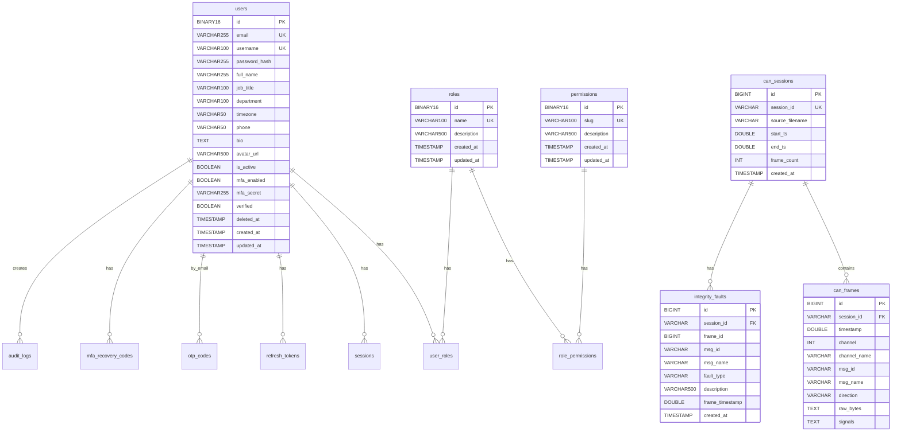

# KPIT Smart Real-Time CAN Analyser — Project Documentation

---

## 1. Project Overview

### What Is This Project?

KPIT Smart Real-Time CAN Analyser is a full-stack platform for ingesting, decoding, analysing, and visualising Controller Area Network (CAN) bus telemetry data. It supports two operational modes:

- **Static mode** — upload a CAN log file, decode it against XML signal catalogues, replay frames with playback controls, and view decoded signal charts.
- **Live mode** — connect to a Python CAN bus simulator (or real CAN adapter), stream decoded frames in real time via WebSocket/STOMP, and watch signal charts update live.

### What Problem Does It Solve?

Automotive engineers need to decode raw CAN bus traffic, detect integrity faults (duplicates, timing gaps, out-of-range signal values), and visualise signal state transitions over time. This platform automates the full pipeline: parse → decode → store → stream → visualise → analyse.

### Tech Stack

| Layer | Technology | Version |
|---|---|---|
| Backend | Spring Boot | 3.4.1 |
| Language (backend) | Java | 17 |
| Frontend | Angular | 21.2.6 |
| State management | @ngrx/signals | 20.0.1 |
| CSS framework | Tailwind CSS | 3.4.0 |
| Parser / Simulator | Python 3 | 3.11+ |
| Message broker | Apache Kafka | 3.8.0 |
| Time-series DB | InfluxDB | 2.7 |
| Relational DB | MySQL | 8.x |
| JWT library | jjwt | 0.12.6 |
| Charting | Chart.js | 4.4.0 (CDN) |

### High-Level Architecture



---

## 2. System Architecture

### Data Flow



### WebSocket/STOMP Flow



### Live Simulator Flow



---

## 3. Project Folder & File Structure

### Backend (`backend/src/main/java/com/example/backend/`)

```
├── BackendApplication.java                     Main Spring Boot entry point
├── config/
│   └── SecurityConfig.java                     Security filter chain, CORS, public paths
├── security/
│   ├── JwtService.java                         JWT generation/validation (HMAC-SHA)
│   ├── JwtAuthenticationFilter.java            Extracts JWT from Authorization header
│   ├── CustomUserDetailsService.java           Loads UserEntity for Spring Security
│   ├── CurrentUserService.java                 Retrieves authenticated user from context
│   ├── SessionHeartbeatFilter.java             Updates session last_active timestamp
│   ├── SecurityHardeningFilter.java            Adds security headers (X-Frame-Options etc.)
│   └── RateLimitFilter.java                    Bucket4j rate limiting per IP
├── controller/
│   ├── AuthController.java                     Login, register, refresh, forgot/reset password, MFA
│   └── v1/
│       ├── UserControllerV1.java               CRUD users with RBAC
│       ├── ProfileControllerV1.java            Profile view/update, avatar upload
│       ├── RoleControllerV1.java               Role CRUD with permission assignment
│       ├── PermissionControllerV1.java         Permission listing
│       ├── AuditLogControllerV1.java           Audit log listing with filters
│       ├── SessionControllerV1.java            Active session management
│       └── AdminHealthControllerV1.java        System health (DB, mail)
├── service/
│   ├── AuthService.java                        Authentication business logic
│   ├── UserServiceV1.java                      User CRUD with pagination/filtering
│   ├── SessionService.java                     Login session lifecycle
│   ├── RoleService.java                        Role management
│   ├── OtpService.java                         6-digit OTP generation/verification
│   ├── MfaTotpService.java                     TOTP MFA (Google Authenticator)
│   ├── EmailService.java                       Sends emails via SMTP
│   ├── AuditService.java                       Creates audit log entries
│   ├── AuditLogService.java                    Queries audit logs
│   ├── AvatarService.java                      Avatar upload/retrieval
│   └── MailHealthService.java                  Tests SMTP connectivity
├── entity/
│   ├── AbstractAuditingEntity.java             Base: created_at, updated_at
│   ├── UserEntity.java                         Users table with soft delete
│   ├── RoleEntity.java                         Roles table
│   ├── PermissionEntity.java                   Permissions table
│   ├── SessionEntity.java                      Login sessions table
│   ├── RefreshTokenEntity.java                 Refresh tokens table
│   ├── OtpCodeEntity.java                      OTP codes table
│   ├── MfaRecoveryCodeEntity.java              MFA recovery codes table
│   └── AuditLogEntity.java                     Audit logs table
├── repository/                                 JPA repositories for all entities
├── dto/                                        Request/response DTOs
├── mapper/
│   └── UserMapper.java                         MapStruct entity↔DTO mapper
├── exception/
│   ├── GlobalExceptionHandler.java             @ControllerAdvice error handler
│   └── ResourceNotFoundException.java          404 exception
├── storage/
│   ├── ImageStorageService.java                Storage interface
│   ├── LocalStorageServiceImpl.java            Local disk storage
│   └── S3StorageServiceImpl.java               AWS S3 storage
├── audit/
│   └── AuditLog.java                           Custom @AuditLog annotation
├── can/
│   ├── config/
│   │   ├── WebSocketConfig.java                STOMP broker + JWT interceptor
│   │   ├── InfluxDbConfig.java                 InfluxDB client bean
│   │   └── CatalogProperties.java              catalog.path property binding
│   ├── controller/
│   │   ├── CanController.java                  Sessions & frames REST
│   │   ├── InfluxController.java               InfluxDB query endpoints
│   │   ├── IntegrityController.java            Integrity faults & summary
│   │   ├── LogUploadController.java            File upload endpoint
│   │   └── SimulatorController.java            Start/stop CAN simulator
│   ├── entity/
│   │   ├── CanSessionEntity.java               can_sessions table
│   │   ├── CanFrameEntity.java                 can_frames table
│   │   └── IntegrityFaultEntity.java           integrity_faults table
│   ├── service/
│   │   ├── CanSessionService.java              Session/frame persistence
│   │   ├── InfluxWriteService.java             Writes signal points to InfluxDB
│   │   ├── InfluxQueryService.java             Flux queries for signal timelines
│   │   ├── IntegrityAnalyzerService.java       Duplicate/gap/range checks
│   │   ├── CatalogLoaderService.java           Loads XML catalogs at startup
│   │   └── LogUploadService.java               Saves file, runs Python pipeline
│   ├── kafka/
│   │   └── CanKafkaConsumer.java               Consumes session-meta + decoded-frames
│   ├── repository/
│   │   └── IntegrityFaultRepository.java       JPA for integrity_faults
│   └── dto/
│       ├── CanSessionResponse.java             Session DTO
│       └── CanFrameResponse.java               Frame DTO
```

### Frontend (`Frontend_angular/src/app/`)

```
├── app.component.ts                            Root component (router-outlet)
├── app.config.ts                               Providers: zoneless, router, HTTP interceptors
├── app.routes.ts                               Top-level routes: auth, admin (guarded)
├── core/
│   ├── auth/
│   │   └── auth.guard.ts                       CanActivate guard — checks AuthStore
│   ├── config/
│   │   └── api.config.ts                       API_BASE_URL constant
│   ├── interceptors/
│   │   └── error.interceptor.ts                HTTP error → toast notifications
│   └── services/
│       ├── auth.service.ts                     Login/register/refresh HTTP calls
│       ├── user.service.ts                     User CRUD HTTP calls
│       ├── profile.service.ts                  Profile HTTP calls
│       ├── audit.service.ts                    Audit log HTTP calls
│       ├── can.service.ts                      CAN sessions/frames/upload HTTP calls
│       ├── telemetry.service.ts                Playback engine (play/pause/seek/speed)
│       ├── live-telemetry.service.ts           Raw SockJS/STOMP WebSocket client
│       ├── toast.service.ts                    Toast notification service
│       ├── breadcrumb.service.ts               Breadcrumb management
│       └── mfa-state.service.ts                MFA enrollment state
├── store/
│   ├── auth.store.ts                           AuthStore (@ngrx/signals)
│   └── user.store.ts                           UserStore (@ngrx/signals)
├── data/
│   ├── models/
│   │   ├── user.model.ts                       User, UserDetail interfaces
│   │   ├── auth.model.ts                       AuthResponse, LoginRequest etc.
│   │   ├── role.model.ts                       Role interface
│   │   ├── permission.model.ts                 Permission interface
│   │   ├── audit-log.model.ts                  AuditLog interface
│   │   └── can.model.ts                        CanSession, CanFrame, IntegrityFault
│   └── types/
│       ├── api.types.ts                        PageResponse generic
│       └── filter.types.ts                     Filter parameter types
├── shared/
│   ├── components/
│   │   ├── data-table/                         Reusable sortable data table
│   │   ├── modal/                              Modal dialog component
│   │   ├── toast/                              Toast notification component
│   │   ├── skeleton/                           Loading skeleton components
│   │   └── breadcrumb/                         Breadcrumb component
│   ├── directives/
│   │   └── has-permission.directive.ts         *hasPermission structural directive
│   └── layout/
│       ├── navbar/                             Top navigation bar
│       └── sidebar/                            Side navigation
├── layouts/
│   └── admin-layout/                           Shell layout with sidebar + navbar
└── features/
    ├── auth/
    │   ├── login/                              Login form
    │   ├── sign-up/                            Registration form
    │   ├── forgot-password/                    Forgot password form
    │   ├── code-verification/                  OTP entry
    │   ├── reset-password/                     New password form
    │   └── mfa-verify/                         MFA TOTP verification
    ├── dashboard/                              Dashboard overview
    ├── users/
    │   ├── user-list/                          Paginated user table
    │   └── user-edit-drawer/                   Slide-out user editor
    ├── settings/
    │   ├── security-center/                    MFA enrollment + active sessions
    │   └── audit-log/                          Audit log viewer
    ├── profile/
    │   └── profile-settings/                   Profile editor with avatar
    └── sniffer/
        ├── sniffer.component.ts/html/css       Main CAN sniffer page
        ├── signal-chart/                       Chart.js signal chart component
        ├── upload/                             Drag-and-drop log upload
        └── simulator/                          Simulator start/stop controls
```

### Python Parser (`python_parser/`)

```
├── pipeline.py                CLI entry: catalog → parse → Kafka publish
├── can_simulator.py           CAN bus simulator (replay/random modes + fault injection)
├── kafka_producer.py          Kafka producer: session-meta + decoded-frames
├── log_parser.py              ASCII CAN log parser → ParsedSession
├── xml_decoder.py             XML catalog loader + frame signal decoder
├── models.py                  Dataclasses: SignalDefinition, MessageDefinition, etc.
├── catalogues/                XML signal catalog files
└── tests/
    ├── test_xml_decoder.py    Unit tests for decoder
    └── test_log_parser.py     Unit tests for parser
```

---

## 4. Backend — Spring Boot

### 4.1 Application Bootstrap

Main class: `BackendApplication.java` with `@SpringBootApplication`. Enables JPA auditing via `@EnableJpaAuditing`. Auto-scans all packages under `com.example.backend`.

### 4.2 Security Configuration

**JWT Implementation:**
- Algorithm: HMAC-SHA (via `Keys.hmacShaKeyFor`)
- Secret: `app.jwt.secret` (minimum 32 chars)
- Access token expiry: 15 minutes (900,000ms)
- Refresh token expiry: 7 days (604,800,000ms)
- Reset token expiry: 15 minutes
- MFA auth token expiry: 5 minutes
- Claims: `subject` (email), `userId`, `type` (access/refresh/reset/mfa_auth), `sessionId`

**Public Paths (no authentication required):**

| Path | Purpose |
|---|---|
| `/api/auth/login` | Login |
| `/api/auth/register` | Registration |
| `/api/auth/refresh` | Token refresh |
| `/api/auth/verify-otp` | OTP verification |
| `/api/auth/forgot-password` | Password reset request |
| `/api/auth/reset-password` | Password reset |
| `/api/auth/mfa/verify` | MFA verification |
| `/v3/api-docs/**` | Swagger docs |
| `/swagger-ui/**` | Swagger UI |
| `/api/can/**` | CAN data endpoints |
| `/api/logs/upload` | Log file upload |
| `/api/simulator/**` | Simulator control |
| `/ws-ecu-gateway/**` | WebSocket endpoint |

**Filter Chain Order:**
1. `SecurityHardeningFilter` — security headers
2. `RateLimitFilter` — Bucket4j IP-based rate limiting
3. `JwtAuthenticationFilter` — JWT extraction and validation
4. `SessionHeartbeatFilter` — updates session last_active

**Rate Limiting:** Uses Bucket4j with per-IP token buckets. Applied to all API requests.

### 4.3 All REST API Endpoints

#### AuthController (`/api/auth`)

| Method | Path | Description | Auth | Request Body | Response |
|---|---|---|---|---|---|
| POST | `/login` | Login with credentials | No | `{email, password}` | `AuthResponse` or 202 `MfaAuthResponse` |
| POST | `/mfa/verify` | Verify MFA TOTP code | No | `{mfaToken, code}` | `AuthResponse` |
| POST | `/register` | Register new user | No | `{email, username, password, fullName}` | `AuthResponse` |
| POST | `/refresh` | Refresh access token | No | `{refreshToken}` | `AuthResponse` |
| POST | `/forgot-password` | Request password reset | No | `{email}` | 200 (empty) |
| POST | `/verify-otp` | Verify OTP code | No | `{email, code}` | `{resetToken}` |
| POST | `/reset-password` | Set new password | No | `{resetToken, newPassword}` | 200 (empty) |

**AuthResponse:**
```json
{
  "accessToken": "eyJ...",
  "refreshToken": "eyJ...",
  "expiresIn": 900,
  "user": { "id": "uuid", "email": "...", "username": "...", "fullName": "...", "isActive": true, "mfaEnabled": false },
  "permissions": [{ "id": "uuid", "slug": "user:read", "description": "..." }]
}
```

#### UserControllerV1 (`/api/v1/users`)

| Method | Path | Description | Auth | Permission |
|---|---|---|---|---|
| GET | `/` | List users (paginated, filtered) | Yes | `user:read` or ADMIN |
| GET | `/{id}` | Get user details | Yes | `user:read` or ADMIN |
| PUT | `/{id}` | Update user profile | Yes | `user:write` or ADMIN |
| PATCH | `/{id}/status` | Toggle active status | Yes | `user:write` or ADMIN |
| PATCH | `/{id}/password` | Change password | Yes | `user:write` or ADMIN |

#### CanController (`/api/can`)

| Method | Path | Description | Auth |
|---|---|---|---|
| GET | `/sessions` | List all CAN sessions | No |
| GET | `/sessions/{sessionId}/frames` | Get frames for session (optional `?msgId=`) | No |

**Example response for `/sessions`:**
```json
[
  {
    "id": 1,
    "sessionId": "a1b2c3d4-...",
    "sourceFilename": "test_log.txt",
    "startTs": 1773230879.89,
    "endTs": 1773230922.45,
    "frameCount": 156,
    "createdAt": "2026-03-30T14:00:00"
  }
]
```

#### InfluxController (`/api/can/influx`)

| Method | Path | Description | Auth |
|---|---|---|---|
| GET | `/sessions/{sessionId}/signals` | List signal names in InfluxDB | No |
| GET | `/sessions/{sessionId}/timeline?signalName=&startTs=&endTs=` | Query signal time-series | No |

#### IntegrityController (`/api/can/integrity`)

| Method | Path | Description | Auth |
|---|---|---|---|
| GET | `/sessions/{sessionId}/faults` | List faults ordered by timestamp | No |
| GET | `/sessions/{sessionId}/summary` | Fault summary (counts by type, healthy flag) | No |
| GET | `/catalog` | Return loaded signal valid values and cycle times | No |

**Example summary response:**
```json
{
  "totalFaults": 5,
  "duplicates": 1,
  "timingGaps": 2,
  "signalRangeViolations": 2,
  "affectedMsgIds": ["0x2FC", "0x23A"],
  "healthy": false
}
```

#### LogUploadController (`/api/logs`)

| Method | Path | Description | Auth |
|---|---|---|---|
| POST | `/upload` | Upload CAN log file (multipart, .txt/.log/.asc, max 50MB) | No |

**Request:** `multipart/form-data` with field `file`.

**Response:**
```json
{ "sessionId": "uuid", "filename": "test.txt", "status": "success" }
```

#### SimulatorController (`/api/simulator`)

| Method | Path | Description | Auth |
|---|---|---|---|
| POST | `/start` | Start simulator subprocess | No |
| POST | `/stop/{simId}` | Stop a specific simulator | No |
| POST | `/stop-all` | Stop all running simulators | No |
| GET | `/status` | List running simulators | No |

**Start request body:**
```json
{
  "mode": "random",
  "speed": 1.0,
  "loop": false,
  "injectValueErrors": false,
  "injectTimingGaps": false,
  "injectCounterErrors": false,
  "faultRate": 0.05
}
```

### 4.4 Kafka Configuration

| Topic | Format | Producer | Consumer |
|---|---|---|---|
| `session-meta` | JSON: `{session_id, source_filename, start_ts, end_ts, frame_count}` | Python (pipeline/simulator) | `CanKafkaConsumer.consumeSessionMeta` |
| `decoded-frames` | JSON: `{timestamp, channel, channel_name, msg_id, msg_name, raw_bytes, signals[], direction}` | Python (pipeline/simulator) | `CanKafkaConsumer.consumeDecodedFrame` |

- Consumer group: `kpit-backend`
- Auto-offset-reset: `earliest`
- Key deserializer: StringDeserializer
- Value deserializer: StringDeserializer
- Kafka record key: `session_id`

**CanKafkaConsumer processing per decoded frame:**
1. Merge session key into JSON if `session_id` is missing
2. `canSessionService.saveFrame()` → MySQL `can_frames`
3. `influxWriteService.writeFrame()` → InfluxDB `can_signals`
4. `integrityAnalyzerService.analyze()` → check for faults → MySQL `integrity_faults`
5. `messagingTemplate.convertAndSend("/topic/frames/{sessionId}", frame)` → WebSocket push

### 4.5 WebSocket / STOMP

- **Endpoint:** `/ws-ecu-gateway` (SockJS enabled, all origins allowed)
- **Broker prefix:** `/topic`
- **Application prefix:** `/app`
- **JWT handshake:** On STOMP `CONNECT`, the `Authorization` header is validated via `JwtService`. If valid, the user principal is set on the accessor.

**Published topics:**

| Topic | Payload | Trigger |
|---|---|---|
| `/topic/sessions` | Session meta JSON | New session-meta consumed |
| `/topic/frames/{sessionId}` | `CanFrameEntity` JSON | New decoded-frame consumed |

### 4.6 InfluxDB Integration

- **Measurement:** `can_signals`
- **Tags:** `session_id`, `msg_id`, `msg_name`, `signal_name`, `channel_name`, `label`
- **Fields:** `value` (double), `raw_value` (double)
- **Timestamp:** Frame's Unix timestamp converted to nanoseconds
- **Write precision:** Nanosecond
- **Retention:** Infinite (0 in Docker setup)
- **Org:** `kpit`
- **Bucket:** `ecu_telemetry`

### 4.7 Integrity Checker

**CatalogLoaderService:** At `@PostConstruct`, loads all XML files from `catalog.path`. For each `<massage>` element, extracts:
- `messageCycleTimes`: `Map<msgName, cycleMs>` from `<Cyclic><status>true</status><cycle>N</cycle></Cyclic>`
- `signalValidValues`: `Map<signalName, Set<Integer>>` from `<values><value>N</value></values>`

**Three check types:**

| Check | Threshold | Fault Type |
|---|---|---|
| Duplicate detection | Gap < 0.001s AND identical raw bytes | `DUPLICATE` |
| Timing gap | Gap > cycleTime × 3.0 | `TIMING_GAP` |
| Signal range violation | `raw_value` not in catalog valid values set | `SIGNAL_RANGE` |

---

## 5. Database Schema — MySQL

Database name: `smart_real_time_analyser`

### ER Diagram



### Table Details

#### `users`

| Column | Type | Nullable | Default | Constraints |
|---|---|---|---|---|
| id | BINARY(16) | No | UUID | PK |
| email | VARCHAR(255) | No | — | UNIQUE |
| username | VARCHAR(100) | No | — | UNIQUE |
| password_hash | VARCHAR(255) | No | — | — |
| full_name | VARCHAR(255) | Yes | NULL | — |
| job_title | VARCHAR(100) | Yes | NULL | — |
| department | VARCHAR(100) | Yes | NULL | — |
| timezone | VARCHAR(50) | Yes | NULL | — |
| phone | VARCHAR(50) | Yes | NULL | — |
| bio | TEXT | Yes | NULL | — |
| avatar_url | VARCHAR(500) | Yes | NULL | — |
| is_active | BOOLEAN | No | true | — |
| mfa_enabled | BOOLEAN | No | false | — |
| mfa_secret | VARCHAR(255) | Yes | NULL | — |
| verified | BOOLEAN | No | false | — |
| deleted_at | TIMESTAMP | Yes | NULL | Soft delete |
| created_at | TIMESTAMP | No | auto | — |
| updated_at | TIMESTAMP | No | auto | — |

Soft delete filter: `@SQLRestriction("deleted_at IS NULL")`

#### `roles`

| Column | Type | Nullable | Constraints |
|---|---|---|---|
| id | BINARY(16) | No | PK |
| name | VARCHAR(100) | No | UNIQUE |
| description | VARCHAR(500) | Yes | — |
| created_at | TIMESTAMP | No | — |
| updated_at | TIMESTAMP | No | — |

#### `permissions`

| Column | Type | Nullable | Constraints |
|---|---|---|---|
| id | BINARY(16) | No | PK |
| slug | VARCHAR(100) | No | UNIQUE |
| description | VARCHAR(500) | Yes | — |
| created_at | TIMESTAMP | No | — |
| updated_at | TIMESTAMP | No | — |

#### `user_roles` (join table)

| Column | Type | Constraints |
|---|---|---|
| user_id | BINARY(16) | FK → users(id) |
| role_id | BINARY(16) | FK → roles(id) |

#### `role_permissions` (join table)

| Column | Type | Constraints |
|---|---|---|
| role_id | BINARY(16) | FK → roles(id) |
| permission_id | BINARY(16) | FK → permissions(id) |

#### `sessions`

| Column | Type | Nullable | Constraints |
|---|---|---|---|
| id | BINARY(16) | No | PK |
| user_id | BINARY(16) | No | FK → users(id) |
| device | VARCHAR(255) | Yes | — |
| ip_address | VARCHAR(45) | Yes | — |
| user_agent | VARCHAR(500) | Yes | — |
| last_active | TIMESTAMP | No | — |
| created_at | TIMESTAMP | No | — |

#### `refresh_tokens`

| Column | Type | Nullable | Constraints |
|---|---|---|---|
| id | BINARY(16) | No | PK |
| user_id | BINARY(16) | No | — |
| session_id | BINARY(16) | Yes | — |
| token_hash | VARCHAR(255) | No | UNIQUE |
| device | VARCHAR(255) | Yes | — |
| ip_address | VARCHAR(45) | Yes | — |
| user_agent | VARCHAR(500) | Yes | — |
| expires_at | TIMESTAMP | No | — |
| revoked_at | TIMESTAMP | Yes | — |
| created_at | TIMESTAMP | No | — |

#### `otp_codes`

| Column | Type | Nullable | Constraints |
|---|---|---|---|
| id | BINARY(16) | No | PK |
| email | VARCHAR(255) | No | INDEX |
| code | VARCHAR(6) | No | — |
| expires_at | TIMESTAMP | No | INDEX |
| used_at | TIMESTAMP | Yes | — |
| created_at | TIMESTAMP | No | — |

#### `mfa_recovery_codes`

| Column | Type | Nullable | Constraints |
|---|---|---|---|
| id | BINARY(16) | No | PK |
| user_id | BINARY(16) | No | INDEX |
| code_hash | VARCHAR(255) | No | — |
| used_at | TIMESTAMP | Yes | — |
| created_at | TIMESTAMP | No | — |

#### `audit_logs`

| Column | Type | Nullable | Constraints |
|---|---|---|---|
| id | BINARY(16) | No | PK |
| user_id | BINARY(16) | Yes | — |
| action | VARCHAR(100) | No | — |
| resource | VARCHAR(100) | No | — |
| resource_id | VARCHAR(36) | Yes | — |
| metadata | JSON | Yes | — |
| ip_address | VARCHAR(45) | Yes | — |
| user_agent | VARCHAR(500) | Yes | — |
| source | ENUM(audit, security) | No | 'audit' |
| created_at | TIMESTAMP | No | — |

#### `can_sessions`

| Column | Type | Nullable | Constraints |
|---|---|---|---|
| id | BIGINT | No | PK, AUTO_INCREMENT |
| session_id | VARCHAR | No | UNIQUE |
| source_filename | VARCHAR | Yes | — |
| start_ts | DOUBLE | Yes | — |
| end_ts | DOUBLE | Yes | — |
| frame_count | INT | Yes | — |
| created_at | TIMESTAMP | No | @CreationTimestamp |

#### `can_frames`

| Column | Type | Nullable | Constraints |
|---|---|---|---|
| id | BIGINT | No | PK, AUTO_INCREMENT |
| session_id | VARCHAR | Yes | — |
| timestamp | DOUBLE | Yes | — |
| channel | INT | Yes | — |
| channel_name | VARCHAR | Yes | — |
| msg_id | VARCHAR | Yes | — |
| msg_name | VARCHAR | Yes | — |
| direction | VARCHAR | Yes | — |
| raw_bytes | TEXT | Yes | — |
| signals | TEXT | Yes | JSON array of decoded signals |

#### `integrity_faults`

| Column | Type | Nullable | Constraints |
|---|---|---|---|
| id | BIGINT | No | PK, AUTO_INCREMENT |
| session_id | VARCHAR | No | — |
| frame_id | BIGINT | Yes | — |
| msg_id | VARCHAR | Yes | — |
| msg_name | VARCHAR | Yes | — |
| fault_type | VARCHAR | No | DUPLICATE/TIMING_GAP/SIGNAL_RANGE |
| description | VARCHAR(500) | Yes | — |
| frame_timestamp | DOUBLE | Yes | — |
| created_at | TIMESTAMP | Yes | @PrePersist |

---

## 6. Frontend — Angular 21

### 6.1 Application Bootstrap

- **Zone-less:** Uses `provideZonelessChangeDetection()` — no Zone.js
- **Router:** `provideRouter(appRoutes)`
- **HTTP:** `provideHttpClient(withInterceptors([authInterceptor, errorInterceptor]))`

**Route Tree:**

```
/                         → redirect to /auth/login
/auth/login               → LoginComponent
/auth/sign-up             → SignUpComponent
/auth/forgot-password     → ForgotPasswordComponent
/auth/code-verification   → CodeVerificationComponent
/auth/reset-password      → ResetPasswordComponent
/auth/mfa-verify          → MfaVerifyComponent
/admin                    → AdminLayoutComponent (guarded)
  /admin/                 → DashboardComponent
  /admin/users            → UserListComponent
  /admin/settings         → SecurityCenter, AuditLog
  /admin/profile          → ProfileSettingsComponent
  /admin/sniffer          → SnifferComponent
```

### 6.2 Authentication Flow

1. User enters email/password → `AuthService.login()` → POST `/api/auth/login`
2. If MFA disabled: receives `AuthResponse` with tokens → `AuthStore.setAuth()` → stores in localStorage
3. If MFA enabled: receives 202 with `mfaToken` → redirect to `/auth/mfa-verify` → user enters TOTP code → POST `/api/auth/mfa/verify`
4. `authInterceptor` adds `Bearer {token}` to all non-public requests
5. `authGuard` checks `AuthStore.isAuthenticated()` and `user.isActive`
6. Token refresh: POST `/api/auth/refresh` with refresh token → new access token

### 6.3 State Management

**AuthStore** (`@ngrx/signals`):
- State: `user`, `accessToken`, `refreshToken`, `isAuthenticated`, `permissions`
- Computed: `permissionSlugs`, `currentUser`, `loggedIn`
- Methods: `setAuth()`, `setAccessToken()`, `updateUser()`, `logout()`, `hasPermission()`

**UserStore** (`@ngrx/signals`):
- State: `users`, `loading`, `selectedUser`, `totalUsers`
- Methods: `loadUsers()`, `selectUser()`, `updateUser()`

### 6.4 HTTP Interceptors

- **authInterceptor:** Skips public auth paths, attaches `Authorization: Bearer {token}` from localStorage for all other requests
- **errorInterceptor:** Catches HTTP errors and shows toast notifications

### 6.5 CAN Sniffer Feature — Detailed

**SnifferComponent** — Main view with tabs: Table, Charts, Integrity.

Key signals:
- `sessions`, `selectedSession`, `allFrames`, `isLiveSession`, `liveFrames`
- `activeTab`, `chartJsLoaded`, `selectedMsgId`
- `liveChartGroups` — stable chart group references for live mode
- `liveTickInterval`, `lastSignalValues`, `lastRealFrameTime` — live ticker state

Key computed:
- `allSignalGroups()` — builds 10 chart groups from frame data
- `signalTimelines()` — slices by playback index for recorded playback
- `liveSignalGroups()` — maps liveChartGroups for template binding

**TelemetryService** — Playback engine:
- Signals: `_frames`, `_playbackIndex`, `_state`, `_speed`, `_playheadTimestamp`
- Computed: `visibleFrames`, `progress`, `currentTime`, `totalTime`, `sliderValue`
- Methods: `loadSession()`, `appendLiveFrame()`, `play()`, `pause()`, `stop()`, `seekTo()`, `seekToPlayhead()`, `setSpeed()`
- Uses `requestAnimationFrame` for smooth playback

**LiveTelemetryService** — WebSocket client:
- Opens raw WebSocket to SockJS endpoint, manually sends STOMP frames
- Subscribes to `/topic/frames/{sessionId}`
- Exposes `frames$` Observable and `connected` / `frameCount` signals

**SignalChartComponent** — Chart.js wrapper:
- Inputs: `groupTitle`, `msgName`, `datasets`, `chartHeight`, `playheadTime`
- Methods: `appendPoint()`, `tickPlayhead()`, `getLastLabel()`
- Y-axis labels decoded via `allLabels` map (in-place mutation for closure stability)
- Stepped line charts with 10 predefined signal groups

---

## 7. Python Parser

### `models.py`

| Dataclass | Fields |
|---|---|
| `SignalDefinition` | `byte_num: int`, `signal_name: str`, `mask: int`, `shift: int`, `value_map: dict[str, str]` |
| `MessageDefinition` | `msg_id: str`, `msg_name: str`, `bus_name: str`, `signals: list[SignalDefinition]` |
| `DecodedSignal` | `signal_name: str`, `raw_value: int`, `label: str` |
| `DecodedFrame` | `timestamp: float`, `channel: int`, `channel_name: str`, `msg_id: str`, `msg_name: str`, `raw_bytes: list[int]`, `signals: list[DecodedSignal]`, `direction: str` |
| `ParsedSession` | `session_id: str`, `source_filename: str`, `start_ts: float`, `end_ts: float`, `frame_count: int`, `frames: list[DecodedFrame]` |

### `xml_decoder.py`

- `load_catalog(catalogue_dir: Path) → dict[str, MessageDefinition]` — Parses all XML files, builds catalog keyed by normalized hex msg_id
- `decode_frame(msg_id: str, data_bytes: list[int], catalog) → list[DecodedSignal]` — Decodes one frame's signals using bit masks and value maps
- `_msg_id_key(msg_id: str) → str` — Normalizes hex IDs (e.g., `0x2fc` → `0x2FC`)
- `_parse_bit_pattern(pattern: str) → (mask, shift)` — Converts 8-char bit pattern to mask/shift

### `log_parser.py`

- `parse_log(log_path: Path, catalog, session_id: str) → ParsedSession` — Parses ASCII CAN log format with regex, decodes known frames, returns session with all frames
- Regex pattern: `^(timestamp) (channel) (msg_id) (Tx|Rx) d (dlc) [(bytes)]`
- Also parses header lines for channel name mapping: `CAN N: channel_name`

### `kafka_producer.py`

- `publish_session(session: ParsedSession, bootstrap_servers: str)` — Publishes session meta to `session-meta` topic and each frame to `decoded-frames` topic
- Uses `confluent_kafka.Producer`
- Key: `session_id` (UTF-8 encoded)

### `pipeline.py`

CLI arguments: `--log PATH`, `--catalogues PATH`, `--session-id UUID`, `--kafka HOST:PORT`, `--dry-run`

Flow: `load_catalog()` → `parse_log()` → `publish_session()` (unless dry-run)

### `can_simulator.py`

CLI arguments: `--mode replay|random`, `--log PATH`, `--catalogues PATH`, `--kafka HOST`, `--speed FLOAT`, `--session-id UUID`, `--loop`, `--inject-value-errors`, `--inject-timing-gaps`, `--inject-counter-errors`, `--fault-rate FLOAT`

**Replay mode:** Parses log file, replays frames at real speed (adjusted by `--speed`), preserving original timing deltas.

**Random mode:** Generates random CAN frames continuously using 5 predefined message definitions (Car_Status, Key_Button_Status, Contact_Status, Latch_Action, key_comm) with realistic cycle times (1–5 seconds). 30% probability of signal value change per cycle.

**Fault injection:** Value corruption (raw_value=99, label="INJECTED_ERROR"), timing gaps (16–20s pauses), counter skips (2–5 frame numbers).

---

## 8. Infrastructure

### 8.1 Docker Compose

| Service | Image | Port | Purpose |
|---|---|---|---|
| `kafka` | apache/kafka:3.8.0 | 9092 | Message broker (KRaft mode, no Zookeeper) |
| `influxdb` | influxdb:2.7 | 8086 | Time-series database for signal data |

**Kafka environment:**
- KRaft mode with single node (broker + controller)
- Replication factor: 1
- Health check: `kafka-topics.sh --list`

**InfluxDB environment:**
- Auto-setup: org=`kpit`, bucket=`ecu_telemetry`, retention=infinite
- Admin user: `admin`/`adminpass123`
- Admin token: `kpit-super-secret-token-2026`
- Volume: `influxdb_data` mounted to `/var/lib/influxdb2`

### 8.2 Kafka Topics

| Topic | Key | Value Format | Producer | Consumer |
|---|---|---|---|---|
| `session-meta` | session_id | `{session_id, source_filename, start_ts, end_ts, frame_count}` | pipeline.py, can_simulator.py | CanKafkaConsumer |
| `decoded-frames` | session_id | `{timestamp, channel, channel_name, msg_id, msg_name, raw_bytes, signals, direction}` | pipeline.py, can_simulator.py | CanKafkaConsumer |

### 8.3 InfluxDB

- **Organization:** kpit
- **Bucket:** ecu_telemetry
- **Retention:** Infinite (0)
- **Token:** Hardcoded in docker-compose and application.properties

---

## 9. Configuration Reference

### `application.properties`

| Key | Default | Description |
|---|---|---|
| `spring.datasource.url` | `jdbc:mysql://localhost:3306/smart_real_time_analyser` | MySQL connection URL |
| `spring.datasource.username` | `root` | MySQL username |
| `spring.datasource.password` | `${DB_PASSWORD:M28d05&}` | MySQL password |
| `spring.jpa.hibernate.ddl-auto` | `update` | Schema auto-update |
| `app.jwt.secret` | `${JWT_SECRET:MySuperSecret...}` | JWT signing key (min 32 chars) |
| `app.jwt.access-token-expiration-ms` | `900000` | 15 minutes |
| `app.jwt.refresh-token-expiration-ms` | `604800000` | 7 days |
| `app.jwt.reset-token-expiration-ms` | `900000` | 15 minutes |
| `app.jwt.mfa-auth-token-expiration-ms` | `300000` | 5 minutes |
| `server.port` | `8080` | HTTP port |
| `spring.kafka.bootstrap-servers` | `localhost:9092` | Kafka broker |
| `spring.kafka.consumer.group-id` | `kpit-backend` | Consumer group |
| `influxdb.url` | `http://localhost:8086` | InfluxDB URL |
| `influxdb.token` | `kpit-super-secret-token-2026` | InfluxDB auth token |
| `influxdb.org` | `kpit` | InfluxDB organization |
| `influxdb.bucket` | `ecu_telemetry` | InfluxDB bucket |
| `spring.websocket.path` | `/ws-ecu-gateway` | WebSocket endpoint |
| `pipeline.python.executable` | Full path to Python venv | Python interpreter |
| `pipeline.python.script` | Full path to pipeline.py | Pipeline script |
| `pipeline.uploads.dir` | `C:/tools/Kpit_c/uploads` | Upload directory |
| `spring.servlet.multipart.max-file-size` | `50MB` | Max upload size |
| `catalog.path` | `C:/tools/Kpit_c/python_parser/catalogues` | XML catalog directory |
| `app.storage.type` | `local` | Storage backend (local/s3) |
| `app.upload.dir` | `uploads/avatars` | Avatar upload directory |

### Angular Configuration

| Key | Value | File |
|---|---|---|
| `API_BASE_URL` | `http://localhost:8080` | `core/config/api.config.ts` |

### Python CLI Arguments

**`pipeline.py`:**
- `--log PATH` (required) — CAN log file path
- `--catalogues PATH` (default: `./catalogues`) — XML catalog directory
- `--session-id UUID` (default: random UUID) — Session identifier
- `--kafka HOST:PORT` (default: `localhost:9092`) — Kafka bootstrap servers
- `--dry-run` — Parse only, skip Kafka

**`can_simulator.py`:**
- `--mode replay|random` (default: `replay`) — Operating mode
- `--log PATH` — Log file (required for replay)
- `--catalogues PATH` (default: `./catalogues`) — XML catalog directory
- `--kafka HOST:PORT` (default: `localhost:9092`) — Kafka broker
- `--speed FLOAT` (default: 1.0) — Playback speed multiplier
- `--session-id UUID` (default: random) — Session ID override
- `--loop` — Loop replay indefinitely
- `--inject-value-errors` — Enable value corruption
- `--inject-timing-gaps` — Enable timing gap injection
- `--inject-counter-errors` — Enable counter skip injection
- `--fault-rate FLOAT` (default: 0.05) — Fault probability per frame

---

## 10. Known Limitations & Technical Debt

### Not Yet Implemented

1. **PDF/Excel report generation** — No ReportService or export endpoints exist
2. **Dockerfiles for application services** — Only Kafka and InfluxDB are in docker-compose; no Dockerfiles for Spring Boot, Angular, or Python
3. **Angular production environment config** — `API_BASE_URL` is hardcoded to `localhost:8080`
4. **Token refresh interceptor** — The frontend `authInterceptor` does not auto-refresh expired tokens; it only attaches the current token
5. **WebSocket reconnection** — `LiveTelemetryService` does not auto-reconnect on connection loss
6. **Playback playhead line** — The playhead overlay plugin (`playheadPlugin`) was removed from the chart config during Y-axis label refactoring and is no longer rendered

### Hardcoded Values That Should Be Configurable

1. **InfluxDB token** in docker-compose: `kpit-super-secret-token-2026`
2. **MySQL password** default: `M28d05&`
3. **JWT secret** default: `MySuperSecretKeyForJwtAuthentication2026Secure`
4. **CORS allowed origin**: hardcoded to `http://localhost:4200`
5. **Python executable paths** in application.properties: absolute Windows paths
6. **Chart signal groups** in `SnifferComponent`: 10 hardcoded groups with specific message IDs
7. **Simulator cycle times**: hardcoded in `can_simulator.py` (1–5 second cycles)
8. **IntegrityAnalyzerService thresholds**: `MIN_INTERVAL_SECONDS = 0.001`, `GAP_MULTIPLIER = 3.0`
9. **Rate limit configuration**: embedded in `RateLimitFilter` code

### Needs Improvement

1. **CAN frame signals column** stores JSON as TEXT — should use MySQL JSON type for query capability
2. **InfluxDB writes are synchronous** (blocking) per frame — should batch writes
3. **IntegrityAnalyzerService state** uses `ConcurrentHashMap` which is lost on restart — should persist last-seen timestamps
4. **No pagination** for CAN frames endpoint — returns all frames for a session
5. **Chart.js loaded via CDN** script tag — should be an npm dependency
6. **Live ticker in sniffer** generates hold points every 200ms which accumulates unbounded data in charts
7. **No authentication** on CAN/simulator/upload endpoints — they are all in the public paths list
8. **Simulator processes** tracked in a static `ConcurrentHashMap` — lost on application restart
9. **No `.env.example`** file for documenting required environment variables
10. **`@ngrx/signals` version** (20.0.1) may have compatibility issues with Angular 21.x — uses `overrides` in package.json

---

## 11. Missing Controller Documentation

### 11.1 ProfileControllerV1 (`/api/v1/profile`)

Self-service endpoints — the authenticated user manages their own profile.

| Method | Path | Description | Auth | Permission |
|---|---|---|---|---|
| GET | `/me` | Get current user's full profile | Yes | — |
| PUT | `/me` | Update current user's profile | Yes | — |
| PATCH | `/me/password` | Change current user's password | Yes | — |
| POST | `/me/mfa/enable` | Start MFA setup (returns secret + QR URL) | Yes | — |
| POST | `/me/mfa/confirm` | Confirm MFA (verify code, enable, return backup codes) | Yes | — |
| POST | `/me/mfa/disable` | Disable MFA (requires password) | Yes | — |
| GET | `/me/sessions` | Get current user's active login sessions | Yes | — |
| POST | `/me/avatar` | Upload avatar image (multipart) | Yes | — |

**GET `/me`**

```json
// Response 200
{
  "id": "550e8400-e29b-41d4-a716-446655440000",
  "email": "admin@ablepro.com",
  "username": "admin",
  "fullName": "Administrator",
  "jobTitle": "System Administrator",
  "department": "IT",
  "timezone": "UTC",
  "phone": null,
  "bio": null,
  "avatarUrl": null,
  "isActive": true,
  "mfaEnabled": false,
  "verified": true,
  "roles": [{ "id": "...", "name": "Admin", "description": "..." }],
  "permissions": [{ "id": "...", "slug": "user:read", "description": "View users" }]
}
```

**PUT `/me`**

```json
// Request
{ "fullName": "John Doe", "phone": "+1-555-1234", "bio": "Software engineer" }

// Response 200 — same as GET /me with updated fields
```

**PATCH `/me/password`**

```json
// Request (SelfPasswordChangeRequest)
{ "currentPassword": "OldPass123!", "newPassword": "NewPass456!" }

// Response 200 (empty body)
```

**POST `/me/mfa/enable`**

```json
// Request: empty body
// Response 200 (MfaEnableResponse)
{ "secret": "JBSWY3DPEHPK3PXP", "qrCodeUrl": "otpauth://totp/AblePro:admin@ablepro.com?secret=..." }
```

**POST `/me/mfa/confirm`**

```json
// Request (MfaConfirmRequest)
{ "code": "123456" }

// Response 200 (MfaConfirmResponse)
{ "backupCodes": ["a1b2c3d4", "e5f6g7h8", "..."] }
```

**POST `/me/mfa/disable`**

```json
// Request (MfaDisableRequest)
{ "password": "MyCurrentPassword123!" }

// Response 200 (empty body)
```

**GET `/me/sessions`**

```json
// Response 200 — List<SessionResponse>
[
  {
    "id": "uuid",
    "device": "Chrome on Windows",
    "ipAddress": "192.168.1.100",
    "lastActive": "2026-03-30T14:00:00Z",
    "createdAt": "2026-03-30T10:00:00Z"
  }
]
```

**POST `/me/avatar`**

- Content-Type: `multipart/form-data`
- Field name: `file`
- Accepted types: image files (JPEG, PNG, etc.)

```json
// Response 200
{ "avatarUrl": "/uploads/avatars/550e8400_avatar.jpg" }
```

### 11.2 RoleControllerV1 (`/api/v1/roles`)

| Method | Path | Description | Auth | Permission |
|---|---|---|---|---|
| GET | `/` | List all roles with their permissions | Yes | `user:read` or ADMIN |
| PUT | `/{id}/permissions` | Update permission mapping for a role | Yes | ADMIN only |

**GET `/`**

```json
// Response 200 — List<RoleWithPermissionsResponse>
[
  {
    "id": "uuid",
    "name": "Admin",
    "description": "Administrator with full access",
    "permissions": [
      { "id": "uuid", "slug": "user:read", "description": "View users" },
      { "id": "uuid", "slug": "user:write", "description": "Create and edit users" }
    ]
  }
]
```

**PUT `/{id}/permissions`**

Annotated with `@AuditLog(action = "ROLE_PERMISSIONS_UPDATE", resource = "roles", resourceIdParam = "id")`.

```json
// Request (RolePermissionsUpdateRequest)
{ "permissionIds": ["uuid-perm-1", "uuid-perm-2", "uuid-perm-3"] }

// Response 200 — RoleWithPermissionsResponse (same shape as GET list item)
```

### 11.3 PermissionControllerV1 (`/api/v1/permissions`)

| Method | Path | Description | Auth | Permission |
|---|---|---|---|---|
| GET | `/` | List all available permission slugs | Yes | `user:read` or ADMIN |

```json
// Response 200 — List<PermissionSlugResponse>
[
  { "id": "uuid", "slug": "user:read", "description": "View users" },
  { "id": "uuid", "slug": "user:write", "description": "Create and edit users" },
  { "id": "uuid", "slug": "user:create", "description": "Create users" },
  { "id": "uuid", "slug": "audit:view", "description": "View audit logs" },
  { "id": "uuid", "slug": "billing:view", "description": "View billing" }
]
```

### 11.4 AuditLogControllerV1 (`/api/v1/audit-logs`)

| Method | Path | Description | Auth | Permission |
|---|---|---|---|---|
| GET | `/` | List audit logs with pagination and filters | Yes | ADMIN or `audit:view` |

**Query parameters:**

| Param | Type | Default | Description |
|---|---|---|---|
| `page` | int | 0 | Page number (0-based) |
| `size` | int | 20 | Page size |
| `action` | String | null | Filter by action name (e.g. `USER_UPDATE`) |
| `userId` | UUID | null | Filter by actor user ID |

```json
// Response 200 — PageResponse<AuditLogResponse>
{
  "content": [
    {
      "id": "uuid",
      "userId": "uuid",
      "action": "USER_UPDATE",
      "resource": "users",
      "resourceId": "uuid-of-updated-user",
      "metadata": { "endpoint": "updateProfile" },
      "ipAddress": "192.168.1.100",
      "userAgent": "Mozilla/5.0 ...",
      "source": "audit",
      "createdAt": "2026-03-30T14:00:00Z"
    }
  ],
  "totalElements": 42,
  "totalPages": 3,
  "page": 0,
  "size": 20
}
```

### 11.5 SessionControllerV1 (`/api/v1/sessions`)

| Method | Path | Description | Auth | Permission |
|---|---|---|---|---|
| DELETE | `/{id}` | Revoke a specific session (own session or admin) | Yes | — (ownership or ADMIN) |

The endpoint checks whether the caller owns the session or has `ROLE_ADMIN`. If neither, the `SessionService.revokeSession` method throws an exception.

```json
// Request: no body, session UUID in path
// Response 204 No Content
```

### 11.6 AdminHealthControllerV1 (`/api/v1/admin/health`)

| Method | Path | Description | Auth | Permission |
|---|---|---|---|---|
| GET | `/mail` | Send a test email to verify SMTP connection | Yes | ADMIN only |

The endpoint calls `MailHealthService.sendTestEmail(adminId)` which attempts to send a test email to the admin's email address. Returns success/failure as a map.

```json
// Response 200
{ "status": "ok", "message": "Test email sent to admin@ablepro.com" }

// Response 200 (on failure)
{ "status": "error", "message": "SMTP connection refused: ..." }
```

---

## 12. Backend Cross-Cutting Concerns

### 12.1 `@AuditLog` Annotation

**Annotation fields:**

| Field | Type | Default | Description |
|---|---|---|---|
| `action` | `String` | (required) | Action identifier, e.g. `USER_UPDATE` |
| `resource` | `String` | (required) | Resource type, e.g. `users`, `roles` |
| `resourceIdParam` | `String` | `"id"` | Name of the method parameter containing the resource ID |

**AuditAspect processing:**

The `AuditAspect` is an `@Around` advice that runs **after** the annotated method succeeds (it calls `joinPoint.proceed()` first, then logs). It captures:

1. **userId** — from `CurrentUserService.getCurrentUserId()` (extracted from JWT in SecurityContext)
2. **resourceId** — extracted by matching `resourceIdParam` against method parameter names via reflection (`MethodSignature.getParameterNames()`)
3. **IP address** — from `HttpServletRequest.getRemoteAddr()` via `RequestContextHolder`
4. **User-Agent** — from the request headers
5. **metadata** — includes `{"endpoint": "<methodName>"}` where `methodName` is `joinPoint.getSignature().getName()`
6. **timestamp** — set at persist time via `AuditLogEntity.@PrePersist`

If the audit logging itself fails, it logs a warning but does not propagate the error — the original operation's response is still returned.

**Methods using `@AuditLog`:**

| Controller | Method | Action | Resource |
|---|---|---|---|
| `UserControllerV1` | `updateProfile` | `USER_UPDATE` | `users` |
| `UserControllerV1` | `toggleStatus` | `USER_TOGGLE_STATUS` | `users` |
| `UserControllerV1` | `changePassword` | `USER_PASSWORD_CHANGE` | `users` |
| `RoleControllerV1` | `updatePermissions` | `ROLE_PERMISSIONS_UPDATE` | `roles` |

**Example resulting audit log entry:**

```json
{
  "id": "550e8400-...",
  "userId": "admin-uuid",
  "action": "USER_UPDATE",
  "resource": "users",
  "resourceId": "target-user-uuid",
  "metadata": { "endpoint": "updateProfile" },
  "ipAddress": "192.168.1.100",
  "userAgent": "Mozilla/5.0 (Windows NT 10.0; Win64; x64) ...",
  "source": "audit",
  "createdAt": "2026-03-30T14:05:23Z"
}
```

### 12.2 JacksonConfig

Located at `com.example.backend.can.config.JacksonConfig`.

- Registers `JavaTimeModule` — enables serialization/deserialization of Java 8+ date/time types (`Instant`, `LocalDateTime`, `ZonedDateTime`, etc.)
- Disables `SerializationFeature.WRITE_DATES_AS_TIMESTAMPS` — dates are serialized as ISO-8601 strings (e.g. `"2026-03-30T14:00:00Z"`) instead of numeric epoch milliseconds
- Marked `@Primary` so this `ObjectMapper` bean takes precedence over any auto-configured one

**Why JavaTimeModule is needed:** The project uses `Instant` in `AbstractAuditingEntity`, `SessionEntity`, `RefreshTokenEntity`, `OtpCodeEntity`, etc. and `LocalDateTime` in `CanSessionEntity` and `IntegrityFaultEntity`. Without this module, Jackson cannot serialize these types and throws exceptions.

### 12.3 WebMvcConfig

Located at `com.example.backend.config.WebMvcConfig`. Implements `WebMvcConfigurer`.

**Static resource mapping:**

| URL Pattern | Filesystem Path | Purpose |
|---|---|---|
| `/uploads/avatars/**` | `file:{app.upload.dir}/` | Serves uploaded avatar images |

The `app.upload.dir` property defaults to `uploads/avatars`. If the path does not start with `/`, it is resolved relative to the application's working directory (prefixed with `./`). A trailing `/` is ensured before passing to `addResourceLocations`.

### 12.4 DataInitializer

Located at `com.example.backend.config.DataInitializer`. Implements `CommandLineRunner`.

- **When:** Runs after Spring context is fully loaded (`CommandLineRunner.run()`)
- **Profile exclusion:** `@Profile("!test")` — excluded when the `test` profile is active
- **Idempotent:** Yes — uses `findBySlug()`, `findByName()`, and `existsByEmailAndDeletedAtIsNull()` before inserting

**Seeded permissions:**

| Slug | Description |
|---|---|
| `user:read` | View users |
| `user:write` | Create and edit users |
| `user:create` | Create users |
| `audit:view` | View audit logs |
| `billing:view` | View billing |

**Seeded roles:**

| Role Name | Description | Permissions |
|---|---|---|
| `Admin` | Administrator with full access | `user:read`, `user:write`, `user:create`, `audit:view`, `billing:view` (all 5) |
| `User` | Standard user | `user:read` (1 only) |

**Seeded users:**

| Email | Username | Password | Full Name | Role | Active | Verified |
|---|---|---|---|---|---|---|
| `admin@ablepro.com` | `admin` | `Admin123!` | Administrator | Admin | true | true |
| `user@ablepro.com` | `user` | `User123!` | Standard User | User | true | true |

Both users have `jobTitle`, `department` set, `timezone` = `UTC`, `mfaEnabled` = `false`.

### 12.5 WebSocketConfig — Detailed

Located at `com.example.backend.can.config.WebSocketConfig`. Implements `WebSocketMessageBrokerConfigurer`.

**`configureMessageBroker`:**
- Simple broker enabled on prefix `/topic` — in-memory message broker, clients subscribe to `/topic/**`
- Application destination prefix: `/app` — messages sent to `/app/**` are routed to `@MessageMapping` methods

**`registerStompEndpoints`:**
- Endpoint: `/ws-ecu-gateway`
- Allowed origins: `*` (all)
- SockJS enabled (`.withSockJS()`) — provides fallback transports for browsers that don't support WebSocket

**SockJS transport URL format (used by Angular client):**

```
ws://localhost:8080/ws-ecu-gateway/{serverId}/{sessionId}/websocket
```

Where `serverId` is a 3-digit random number (e.g. `042`) and `sessionId` is an 8-character random alphanumeric string.

**JWT interceptor — step-by-step validation logic:**

1. A `ChannelInterceptor` is registered on the inbound client channel
2. On `preSend`, it checks if the STOMP command is `CONNECT`
3. Reads the `Authorization` native header from the STOMP frame
4. If header starts with `Bearer `, extracts the token substring
5. Calls `jwtService.isTokenValid(token)` — if invalid or expired, the message passes through without authentication (anonymous connection)
6. If valid, extracts email via `jwtService.getEmailFromToken(token)`
7. Loads `UserDetails` via `userDetailsService.loadUserByUsername(email)`
8. Creates a `UsernamePasswordAuthenticationToken` with the user details and authorities
9. Sets this as the user principal on the `StompHeaderAccessor`

**If JWT is invalid on CONNECT:** The connection proceeds as anonymous — no exception is thrown, no error frame is sent. The `catch` block logs a warning. The client will be connected but without an authenticated principal.

---

## 13. Frontend — Missing Details

### 13.1 HasPermissionDirective

- **Selector:** `[appHasPermission]` — used as `*appHasPermission="'user:write'"`
- **Type:** Structural directive (standalone)
- **Input:** `appHasPermission` — a `string` (permission slug) via `input.required<string>()`
- **Mechanism:** Uses `effect()` which reactively reads the permission input and calls `AuthStore.hasPermission(slug)`. If the user has the permission, it creates an embedded view from the template ref. If not, it clears the view container.
- **Behavior when absent:** The element is **removed from DOM** entirely (not just hidden) via `viewContainer.clear()`

**Template usage example:**

```html
<button *appHasPermission="'user:write'" class="btn">Edit User</button>
```

### 13.2 Security Center Feature

**`SecurityCenterComponent`** is a container that renders two sub-components side by side in a 2-column grid:
- `MfaEnrollmentComponent` (left column)
- `ActiveSessionsComponent` (right column)

It accepts an `embedded` input (default `false`). When not embedded, it renders a breadcrumb header and page title. When embedded (e.g., within profile settings), those are hidden.

**MFA enrollment flow (step by step):**

1. `MfaEnrollmentComponent.ngOnInit()` — reads `authStore.user()?.mfaEnabled` to set `isEnrolled` signal
2. User clicks "Enable MFA" → calls `startEnrollment()` → calls `profileService.mfaEnable()` → **POST** `/api/v1/profile/me/mfa/enable`
3. Backend returns `{ secret, qrCodeUrl }` → displayed in the template (QR code image, secret text)
4. User scans QR code in authenticator app, enters 6-digit code
5. User submits → `onSubmit()` → calls `profileService.mfaConfirm(code)` → **POST** `/api/v1/profile/me/mfa/confirm`
6. Backend verifies TOTP code, activates MFA, returns backup codes
7. On success: `isEnrolled` set to `true`, `authStore.updateUser()` called with `mfaEnabled: true`, toast shows success
8. User can cancel enrollment via `cancelEnrollment()` which resets signals

**Active sessions list:**

- `ActiveSessionsComponent.ngOnInit()` → calls `profileService.getSessions()` → **GET** `/api/v1/profile/me/sessions`
- Displays: device name, IP address, last active time, created time
- Each session has a "Revoke" button → `revokeSession(session)` → calls `profileService.revokeSession(id)` → **DELETE** `/api/v1/sessions/{id}`
- On success: removes the session from the local list, shows toast
- Shows a loading spinner via `isLoading` signal and tracks which session is being revoked via `revokingId` signal

### 13.3 Sniffer Component — Complete Method Reference

#### `onSimulatorStarted(): void`
Called when the simulator control component emits a start event. Waits 3 seconds (to allow Kafka consumer to persist the session), then calls `loadSessions()` with a callback that auto-selects the first session. Also starts a 5-second refresh interval (`simRefreshInterval`) to keep reloading sessions while the simulator runs.

#### `onSimulatorStopped(): void`
Called when the simulator is stopped. Immediately calls `stopLiveTicker()` and sets `isLiveSession` to `false`. Clears the `simRefreshInterval`. After a 2-second delay, reloads sessions to pick up the final frame count.

#### `startLiveTicker(): void`
Clears any existing ticker, then creates a new `setInterval` at 200ms. On each tick:
1. **Idle check:** If `lastRealFrameTime > 0` and more than 10 seconds have passed since the last real frame, stops the ticker and sets `isLiveSession` to `false` (auto-stop when simulator has stopped producing frames).
2. **Session guard:** If no session selected or not a live session, stops the ticker.
3. **Empty guard:** If `lastSignalValues` map is empty (no signals seen yet), skips.
4. **Relative time:** Computes `relTime = Date.now()/1000 - session.startTs` (Unix seconds).
5. **Negative guard:** If `relTime < 0`, skips (safety for old log timestamps).
6. **Hold points:** For each entry in `lastSignalValues`, builds a point `{ x: relTime, y: value, label }` and calls `chart.appendPoint()` on every chart component that has a matching dataset.

#### `stopLiveTicker(): void`
Clears the `liveTickInterval` if it's running. Called from `onSimulatorStopped()`, `selectSession()` (non-live branch), `ngOnDestroy()`, and from within the ticker itself on idle timeout.

#### `normalizeLiveFrame(raw: any): CanFrame`
Maps a raw WebSocket frame object (which may use snake_case from the Java backend or mixed casing) into the Angular `CanFrame` interface:

| Raw field | CanFrame field | Fallback |
|---|---|---|
| `raw.id` | `id` | `0` |
| `raw.sessionId` / `raw.session_id` | `sessionId` | `''` |
| `raw.timestamp` | `timestamp` | `0` |
| `raw.channel` | `channel` | `0` |
| `raw.channelName` / `raw.channel_name` | `channelName` | `''` |
| `raw.msgId` / `raw.msg_id` | `msgId` | `''` |
| `raw.msgName` / `raw.msg_name` | `msgName` | `''` |
| `raw.direction` | `direction` | `'Rx'` |
| `raw.rawBytes` (string) / `raw.rawBytes` / `raw.raw_bytes` (array) | `rawBytes` | `JSON.stringify([])` |
| `raw.signals` (string) / `raw.signals` (array) | `signals` | `JSON.stringify([])` |

For `rawBytes` and `signals`: if the value is already a string, it's used directly. Otherwise the object/array is `JSON.stringify()`'d.

#### `buildLiveChartGroupBindings(): Array<{groupTitle, msgName, datasets}>`
Builds a stable reference for live chart `[datasets]` inputs. Maps `allSignalGroups()` → strips `frameIndex` from points, converts `signalDefs` to `ChartDataset[]`. Called from `loadFrames()` (live branch), `setTab('charts')` (live branch), and serves as the initial chart state when switching to charts tab during live streaming.

#### `loadIntegrity(sessionId: string): void`
Sets `loadingIntegrity` to `true`. Makes two parallel HTTP calls:
1. `canService.getIntegritySummary(sessionId)` → sets `integritySummary` signal
2. `canService.getIntegrityFaults(sessionId)` → sets `integrityFaults` signal

Called from `selectSession()` and `setTab('integrity')`.

#### `onUploadComplete(sessionId: string): void`
Called when the upload component emits a successful upload. Waits 2 seconds (to let the Python pipeline and Kafka consumer finish processing), then calls `loadSessions(sessionId)` which auto-selects the newly created session.

#### `onSeek(event: Event): void`
Reads the numeric value from the range input element (`HTMLInputElement.value`) and passes it to `telemetry.seekToPlayhead(val)`. This maps a linear slider position (0 to frames.length-1) to a timestamp-based playback seek.

### 13.4 LiveTelemetryService — Complete Reference

**Signals:**
- `connected: WritableSignal<boolean>` — whether the STOMP connection is established
- `frameCount: WritableSignal<number>` — count of frames received in current session

**Observables:**
- `frames$: Observable<any>` — emits each parsed frame object from STOMP MESSAGE commands

**`connectToSession(sessionId: string): void`**
Resets `frameCount` to 0, calls `disconnect()` to clean up any existing connection, then calls `openSocket(sessionId)`.

**`disconnect(): void`**
Sets `stompConnected` to `false`, `connected` signal to `false`. If a `socket` exists, calls `socket.close()` and sets it to `null`.

**`openSocket(sessionId: string): void`**
Constructs the SockJS WebSocket URL:
1. Replaces `http` with `ws` in `API_BASE_URL` (e.g. `ws://localhost:8080`)
2. Generates `serverId` — 3-digit zero-padded random number (0–999)
3. Generates `sockId` — 8-character random alphanumeric from `Math.random().toString(36)`
4. Final URL: `ws://localhost:8080/ws-ecu-gateway/{serverId}/{sockId}/websocket`

Sets `onmessage`, `onerror`, `onclose` handlers.

**`handleRaw(data: string, sessionId: string): void`**

SockJS frame parsing:

| Frame | Meaning | Action |
|---|---|---|
| `'o'` | SockJS open frame | Sends STOMP `CONNECT` with `accept-version:1.2`, `heart-beat:0,0`, `host`, and `Authorization:Bearer {token}` |
| `'h'` | SockJS heartbeat | Ignored |
| `'c...'` | SockJS close frame | Ignored |
| `'a[...]'` | SockJS data frame (array of strings) | Parsed below |

For `'a[...]'` frames:
1. Strip the `a` prefix, `JSON.parse()` the remainder → array of raw STOMP frame strings
2. For each string: find `\0` (null terminator), take text before it, split on `\n\n` → header section and body section
3. Extract command from first line of header section
4. **`CONNECTED`** → set `stompConnected = true`, `connected` signal to `true`, send `SUBSCRIBE` to `/topic/frames/{sessionId}` with id `sub-live`
5. **`MESSAGE`** → `JSON.parse(body)`, increment `frameCount`, emit on `frameSubject`

**`send(data: string): void`**
Sends raw string to the WebSocket if the socket exists and is in `OPEN` readyState.

### 13.5 TelemetryService — Complete Reference

**Private signals:**
- `_frames: WritableSignal<CanFrame[]>` — all frames in the session
- `_playbackIndex: WritableSignal<number>` — current frame index (integer)
- `_state: WritableSignal<PlaybackState>` — `'stopped'` | `'playing'` | `'paused'`
- `_speed: WritableSignal<number>` — playback speed multiplier (default 1)
- `_playheadTimestamp: WritableSignal<number>` — smooth log-time timestamp for playhead

**Private fields (not signals):**
- `_timer: any` — setTimeout handle (legacy, currently unused)
- `animationId: any` — requestAnimationFrame handle
- `playStartTime: number` — `performance.now()` when play started
- `playStartFrameIndex: number` — frame index when play started
- `playStartTimestamp: number` — log timestamp when play started

**Public readonly signals:**
- `frames` — readonly view of `_frames`
- `playbackIndex` — readonly view of `_playbackIndex`
- `state` — readonly view of `_state`
- `speed` — readonly view of `_speed`

**Computed signals:**

| Name | Formula |
|---|---|
| `visibleFrames` | `_frames().slice(0, _playbackIndex() + 1)` |
| `progress` | `((playheadTimestamp - firstTs) / (lastTs - firstTs)) * 100` (0–100%) |
| `currentTime` | `playheadTimestamp - frames[0].timestamp` (seconds from session start) |
| `totalTime` | `frames[last].timestamp - frames[0].timestamp` (total duration) |
| `sliderValue` | `((playheadTimestamp - firstTs) / (lastTs - firstTs)) * maxIndex` (fractional 0..N-1) |

**`loadSession(frames: CanFrame[]): void`**
Calls `stop()`, sets `_frames`, sets `_playbackIndex` to last frame, sets `_playheadTimestamp` to last frame's timestamp. This shows all frames immediately.

**`appendLiveFrame(frame: CanFrame): void`**
Appends frame to `_frames` (spread + push). If state is `'stopped'`, keeps `_playbackIndex` at the last index. Always updates `_playheadTimestamp` to the frame's timestamp.

**`play(): void`**
If no frames, returns. If `stopped`, resets to index 0. Sets state to `'playing'`. Records `playStartTime = performance.now()`, `playStartFrameIndex = _playbackIndex()`, `playStartTimestamp = frames[currentIndex].timestamp`. Starts the `tick()` loop.

**`pause(): void`**
Sets state to `'paused'`. Calls `clearTimer()`.

**`stop(): void`**
Calls `clearTimer()`, sets state to `'stopped'`, sets `_playbackIndex` to **last frame** (not first), sets `_playheadTimestamp` to last frame's timestamp. This means "stopped" shows all data.

**`seekTo(index: number): void`**
Clamps index to [0, frames.length-1], sets `_playbackIndex`, sets `_playheadTimestamp` to `frames[clamped].timestamp`. If currently playing, resets the play-start anchors so playback continues from the seek point.

**`seekToPlayhead(linear: number): void`**
Maps a fractional slider value (0..maxIndex) to a log-time timestamp via linear interpolation: `t = t0 + (linear/maxIndex) * (t1-t0)`. Then finds the last frame index whose timestamp ≤ t by walking forward. Sets `_playbackIndex` and `_playheadTimestamp`. Resets play-start anchors if playing.

**`tick(): void` (the animation loop)**
If not `'playing'`, returns. Computes `elapsed = ((performance.now() - playStartTime) / 1000) * speed`. Target timestamp = `playStartTimestamp + elapsed`. Walks forward from `playStartFrameIndex` to find the last frame whose timestamp ≤ target. Sets `_playbackIndex`. Clamps playhead to last frame's timestamp. If reached the last frame, sets state to `'stopped'` and returns. Otherwise, calls `requestAnimationFrame(() => this.tick())`.

**`clearTimer(): void`**
Clears both `_timer` (setTimeout) and `animationId` (requestAnimationFrame).

### 13.6 SignalChartComponent — Complete Reference

**Inputs (`@Input()`):**

| Name | Type | Default | Description |
|---|---|---|---|
| `groupTitle` | `string` | `''` | Chart card title (e.g. "Door Latch & Lock State") |
| `msgName` | `string` | `''` | CAN message name badge (e.g. "Car_Status") |
| `datasets` | `ChartDataset[]` | `[]` | Array of signal datasets with points |
| `chartHeight` | `number` | `140` | Canvas height in pixels |
| `playheadTime` | `number` | `0` | Current playhead time (seconds from session start) |

**`ChartDataset` interface:**
```typescript
{ signalName: string; color: string; points: { x: number; y: number; label: string }[] }
```

**Private fields:**
- `chart: any` — Chart.js instance
- `currentPlayheadDraw: number` — last playhead time drawn (currently unused since playhead plugin was removed)
- `yLabelMap: Map<number, string>` — numeric value → decoded label (used for tooltip)
- `allLabels: Record<number, string>` — same mapping as plain object (**mutated in place** so the Y-axis tick callback closure always reads current data)

**Public methods:**

| Method | Signature | Description |
|---|---|---|
| `getLastLabel` | `(ds: ChartDataset): string` | Returns decoded label for the last point in a dataset, or `'—'` if empty. Looks up `allLabels[last.y]` falling back to `String(last.y)` |
| `updatePlayhead` | `(time: number): void` | Sets `currentPlayheadDraw` and triggers `chart.update('none')` |
| `appendPoint` | `(signalName: string, point: {x, y, label}): void` | Finds the dataset by name, pushes the point into both `this.datasets[i].points` and `chartDs.data`, updates `yLabelMap` and `allLabels` in place for decoded labels, calls `chart.update('none')` |
| `tickPlayhead` | `(time: number): void` | Delegates to `updatePlayhead(time)` |

**Private methods:**

| Method | Description |
|---|---|
| `getChartJs()` | Returns `window.Chart` (Chart.js loaded via CDN) |
| `rebuildYLabelMap()` | Clears `yLabelMap`, walks all datasets/points, populates non-`raw:` labels. Then **clears and repopulates `allLabels` in place** (using `delete` on existing keys, then setting new ones) |
| `buildDatasets()` | Maps `this.datasets` to Chart.js dataset objects: `stepped: true`, `pointRadius: 3`, `fill: false`, `tension: 0` |
| `initChart()` | Creates Chart.js instance. Calls `rebuildYLabelMap()` first. Config: `type: 'line'`, `animation: false`, `parsing: false`, interaction mode `index` |
| `updateChart()` | Calls `rebuildYLabelMap()`, rebuilds datasets, calls `chart.update()` (full update to rebuild scales) |

**Y-axis label mechanism:**

The `allLabels` object is created once as a class field (`private allLabels: Record<number, string> = {};`). The Y-axis tick callback in `initChart` captures `this.allLabels` in its closure. Because the object **reference** never changes (keys are deleted and re-added in place by `rebuildYLabelMap()`), the callback always sees the current label data even though Chart.js caches the callback function. The callback logic: `this.allLabels[Number(value)] !== undefined ? this.allLabels[Number(value)] : Number(value)`.

**Chart.js configuration:**

| Option | Value | Reason |
|---|---|---|
| `type` | `'line'` | Time-series signal visualization |
| `animation` | `false` | Performance — no transition animations |
| `parsing` | `false` | Data already in `{x, y}` format |
| `interaction.mode` | `'index'` | Tooltip shows all datasets at same X |
| `interaction.intersect` | `false` | Tooltip triggers on nearest X, not requiring hover on point |
| `legend.display` | `false` | Custom legend rendered in template |
| `scales.x.type` | `'linear'` | Numeric seconds axis |
| `scales.x.maxTicksLimit` | `10` | Prevent tick clutter |
| `scales.y.type` | `'linear'` | Numeric with decoded labels via callback |
| `scales.y.stepSize` | `1` | Integer-only ticks for discrete signal values |
| `scales.y.beginAtZero` | `true` | Y axis starts at 0 |
| `stepped` | `true` on all datasets | Square waveform rendering (signal holds value until next change) |

**Note on playhead line:** The playhead overlay plugin (`playheadPlugin`) was previously a top-level Chart.js plugin that drew a dashed vertical line at the current playback time. It was removed during Y-axis label refactoring and is **not currently rendered**. The `currentPlayheadDraw` field and `updatePlayhead`/`tickPlayhead` methods still exist but only trigger a chart update without visual effect.

---

## 14. Database — Missing Details

### 14.1 `sessions` Table — Complete

| Column | Type | Nullable | Default | Constraints |
|---|---|---|---|---|
| `id` | BINARY(16) | No | UUID | PK |
| `user_id` | BINARY(16) | No | — | FK → users(id) |
| `device` | VARCHAR(255) | Yes | NULL | — |
| `ip_address` | VARCHAR(45) | Yes | NULL | — |
| `user_agent` | VARCHAR(500) | Yes | NULL | — |
| `last_active` | TIMESTAMP | No | current time | — |
| `created_at` | TIMESTAMP | No | current time | — |

**SessionHeartbeatFilter:** A Spring Security filter that runs after `JwtAuthenticationFilter`. On each authenticated request, it extracts the `sessionId` claim from the JWT, looks up the `SessionEntity`, and updates `lastActive` to `Instant.now()`. This keeps track of when a session was last used.

**SessionControllerV1 usage:** The `DELETE /{id}` endpoint calls `sessionService.revokeSession(id, userId, isAdmin)` which invalidates the session and its associated refresh token. The session record itself may be soft-deleted or marked revoked depending on the implementation.

### 14.2 `audit_logs` Table — Complete

**Source ENUM values:**

| Value | Meaning |
|---|---|
| `audit` | Business-level audit entries created by `@AuditLog` annotation (user actions like update, toggle status, password change, permission change) |
| `security` | Security-related entries created by `AuthService` (login, registration, password reset, failed login attempts, MFA verification) |

**Action values used with `@AuditLog`:**

| Action | Resource | Trigger |
|---|---|---|
| `USER_UPDATE` | `users` | `UserControllerV1.updateProfile()` |
| `USER_TOGGLE_STATUS` | `users` | `UserControllerV1.toggleStatus()` |
| `USER_PASSWORD_CHANGE` | `users` | `UserControllerV1.changePassword()` |
| `ROLE_PERMISSIONS_UPDATE` | `roles` | `RoleControllerV1.updatePermissions()` |

**Security actions (created by AuthService directly):**
`LOGIN`, `LOGIN_FAILED`, `REGISTER`, `REFRESH_TOKEN`, `FORGOT_PASSWORD`, `VERIFY_OTP`, `RESET_PASSWORD`, `MFA_VERIFY`

**Example metadata JSON:**

```json
{ "endpoint": "updateProfile" }
```

For security events, metadata may include additional fields like `{ "reason": "invalid_credentials" }` or `{ "email": "user@example.com" }`.

### 14.3 MySQL External Setup Note

**MySQL is NOT included in `docker-compose.yml`.** It must be installed and running separately before starting the Spring Boot backend.

**Requirements:**
- MySQL 8.x installed and running on `localhost:3306`
- Database: `smart_real_time_analyser` (created automatically by `createDatabaseIfNotExist=true` in the JDBC URL)
- User: `root` with password configured via `DB_PASSWORD` environment variable (default: `M28d05&`)
- The user must have full DDL + DML privileges on the database
- Schema is managed automatically by Hibernate with `spring.jpa.hibernate.ddl-auto=update` — tables are created on first run and altered as entities change

---

## 15. Environment Setup Guide

### 15.1 Prerequisites

| Tool | Version | Purpose |
|---|---|---|
| Java JDK | 17+ | Spring Boot backend |
| Maven | 3.9+ (or use `mvnw` wrapper) | Backend build |
| Node.js | 22+ | Angular frontend |
| npm | 10+ | Frontend package manager |
| Python | 3.11+ | CAN parser and simulator |
| MySQL | 8.x | Relational database |
| Docker Desktop | Latest | Kafka and InfluxDB containers |

### 15.2 Infrastructure Setup

```bash
# Start Kafka + InfluxDB
cd C:/tools/Kpit_c
docker-compose up -d

# Verify services are healthy
docker ps
# kafka       → healthy
# influxdb    → healthy
```

InfluxDB UI available at `http://localhost:8086` (admin/adminpass123).

### 15.3 MySQL Setup

```sql
-- MySQL should be running on localhost:3306
-- The database is created automatically, but you can create it manually:
CREATE DATABASE IF NOT EXISTS smart_real_time_analyser;

-- Ensure root user has access (or configure a dedicated user)
-- Update application.properties if using a different user/password
```

### 15.4 Backend Setup

```bash
cd C:/tools/Kpit_c/backend

# Review application.properties — key settings to verify:
# - spring.datasource.password (or set DB_PASSWORD env var)
# - pipeline.python.executable (must point to your Python venv)
# - pipeline.uploads.dir (must be writable)
# - catalog.path (must point to python_parser/catalogues)

# Run with Maven wrapper
.\mvnw.cmd spring-boot:run

# Backend starts on http://localhost:8080
# Swagger UI: http://localhost:8080/swagger-ui.html
```

### 15.5 Python Parser Setup

```bash
cd C:/tools/Kpit_c/python_parser

# Create virtual environment
python -m venv .venv

# Activate (Windows)
.venv\Scripts\activate

# Install dependencies
pip install confluent-kafka

# Test the parser
python xml_decoder.py
# Should print: "Total messages loaded: N"

# Test the pipeline (dry run)
python pipeline.py --log path/to/your/logfile.txt --dry-run
```

### 15.6 Frontend Setup

```bash
cd C:/tools/Kpit_c/Frontend_angular

npm install
npm start

# Angular dev server starts on http://localhost:4200
```

### 15.7 First Run

1. Open `http://localhost:4200` in your browser
2. Login with default admin account:
   - **Email:** `admin@ablepro.com`
   - **Password:** `Admin123!`
3. Or with default user account:
   - **Email:** `user@ablepro.com`
   - **Password:** `User123!`
4. Navigate to **Admin → Sniffer**
5. Either:
   - **Upload a log file** using the upload component (`.txt`, `.log`, or `.asc` format)
   - **Start the simulator** (random mode generates frames continuously)
6. Select a session from the dropdown to view frames in the table
7. Switch to the **Charts** tab to see signal visualizations
8. Switch to the **Integrity** tab to see fault analysis

---

## 16. `.env.example` Reference

The following environment variables should be set in production rather than using the defaults hardcoded in `application.properties`:

```env
# ─── Database ───────────────────────────────────────────────
DB_PASSWORD=your_secure_mysql_password

# ─── JWT ────────────────────────────────────────────────────
JWT_SECRET=your_minimum_32_character_secret_key_for_jwt_signing

# ─── Mail (SMTP) ───────────────────────────────────────────
MAIL_HOST=smtp.example.com
MAIL_PORT=587
MAIL_USERNAME=noreply@example.com
MAIL_PASSWORD=your_mail_password
MAIL_FROM=noreply@example.com

# ─── Storage ───────────────────────────────────────────────
STORAGE_TYPE=local
# S3 (only if STORAGE_TYPE=s3)
S3_BUCKET=your-bucket-name
AWS_REGION=eu-west-1
AWS_ACCESS_KEY_ID=your_aws_access_key
S3_SECRET=your_aws_secret_key

# ─── InfluxDB ──────────────────────────────────────────────
# Must match docker-compose.yml DOCKER_INFLUXDB_INIT_ADMIN_TOKEN
INFLUX_TOKEN=your_influx_admin_token

# ─── Python Pipeline ──────────────────────────────────────
# Absolute paths to the Python virtual environment and scripts
PYTHON_EXECUTABLE=/path/to/python_parser/.venv/bin/python
PIPELINE_SCRIPT=/path/to/python_parser/pipeline.py
UPLOADS_DIR=/path/to/uploads
CATALOG_PATH=/path/to/python_parser/catalogues
```

**Notes:**
- `JWT_SECRET` must be at least 32 characters for HMAC-SHA256
- `DB_PASSWORD` is referenced in `application.properties` as `${DB_PASSWORD:M28d05&}`
- `INFLUX_TOKEN` in `application.properties` is currently hardcoded — should be externalized via `${INFLUX_TOKEN:...}`
- Python paths use forward slashes on all platforms; on Windows, either forward or backslashes work
- The `UPLOADS_DIR` must exist and be writable by the Spring Boot process

---

## 17. Python Dependencies (`requirements.txt`)

### Dependency Table

| Package | Version | Purpose | Imported By |
|---|---|---|---|
| `confluent-kafka` | 2.4.0 | Kafka producer client for publishing session metadata and decoded frames | `kafka_producer.py`, `can_simulator.py` |
| `lxml` | 5.2.2 | XML parsing library (available but project currently uses `xml.etree.ElementTree` from stdlib) | Not directly imported — available as a faster alternative to `ElementTree` |
| `dataclasses-json` | 0.6.7 | JSON serialization/deserialization for dataclasses | Not directly imported — available for optional JSON marshalling of `models.py` dataclasses |
| `pytest` | 8.2.2 | Test framework for running unit tests | `tests/test_xml_decoder.py`, `tests/test_log_parser.py` |

**Note:** The project's core parsing logic (`xml_decoder.py`, `log_parser.py`, `models.py`) uses only the Python standard library (`xml.etree.ElementTree`, `dataclasses`, `re`, `json`, `pathlib`). The `lxml` and `dataclasses-json` packages are listed in requirements but not actively imported — they may be retained for future use or as optional accelerators.

### Installation

```bash
cd python_parser
python -m venv .venv

# Windows
.venv\Scripts\activate

# Linux/Mac
source .venv/bin/activate

pip install -r requirements.txt
```

---

## 18. Python Unit Tests

### 18.1 Test Coverage Overview

| File | Location | Tests Module | Test Cases |
|---|---|---|---|
| `test_xml_decoder.py` | `python_parser/tests/` | `xml_decoder` (`_parse_bit_pattern`, `decode_frame`) | 6 |
| `test_log_parser.py` | `python_parser/tests/` | `log_parser` (`parse_log`) | 2 |

**Total test cases: 8**

### 18.2 `tests/test_xml_decoder.py` — Complete Reference

#### `test_parse_bit_pattern_rightmost_bits`
- **Tests:** `_parse_bit_pattern("xxxxxx11")`
- **Expected:** `(0x03, 0)` — mask covers bits 0–1, shift is 0
- **Assertion:** Exact tuple equality
- **Edge case:** Lowest possible bit positions

#### `test_parse_bit_pattern_middle_bits`
- **Tests:** `_parse_bit_pattern("xxxx11xx")`
- **Expected:** `(0x0C, 2)` — mask covers bits 2–3, shift is 2
- **Assertion:** Exact tuple equality
- **Edge case:** Non-zero shift with contiguous bits in the middle

#### `test_parse_bit_pattern_high_bits`
- **Tests:** `_parse_bit_pattern("11xxxxxx")`
- **Expected:** `(0xC0, 6)` — mask covers bits 6–7, shift is 6
- **Assertion:** Exact tuple equality
- **Edge case:** Highest possible bit positions

#### `test_parse_bit_pattern_wide`
- **Tests:** `_parse_bit_pattern("xx111111")`
- **Expected:** `(0x3F, 0)` — mask covers bits 0–5, shift is 0
- **Assertion:** Exact tuple equality
- **Edge case:** Wide mask spanning 6 bits

#### `test_decode_frame_door_latch`
- **Tests:** `decode_frame("0x2FC", [1,0,0,0,0,0,0,0], catalog)` with a catalog containing one signal (`door_latche_status`, byte 0, mask `0x0F`, shift 0, value map `{"1": "Unlocked", "4": "Secured"}`)
- **Expected:** One `DecodedSignal` with `raw_value=1`, `label="Unlocked"`
- **Assertions:** Length == 1, `raw_value` == 1, `label` == `"Unlocked"`
- **Edge case:** Verifies signal extraction with a known value map entry

#### `test_decode_frame_unknown_msg`
- **Tests:** `decode_frame("0xDEAD", [0]*8, {})` — empty catalog
- **Expected:** Empty list
- **Assertion:** Result `== []`
- **Edge case:** Message ID not present in catalog returns gracefully

### 18.3 `tests/test_log_parser.py` — Complete Reference

#### `test_parse_minimal_log`
- **Tests:** `parse_log()` with a temp file containing a date header, two CAN channel headers (`CAN 1: Car_CAN`, `CAN 2: Key_CAN`), and two frame lines for msg IDs `0x2FC` and `0x23A`
- **Catalog:** Two `MessageDefinition` entries (no signals defined, just message names)
- **Expected:** `ParsedSession` with `frame_count=2`, `start_ts=1773230879.890181`, first frame `msg_id="0x2FC"`
- **Assertions:** Frame count, start timestamp, first frame message ID
- **Edge case:** Verifies channel name mapping from header lines, timestamp precision (6 decimal places)

#### `test_unknown_msg_id_not_skipped`
- **Tests:** `parse_log()` with a frame using msg ID `0xDEAD` that is not in the catalog
- **Catalog:** Empty `{}`
- **Expected:** One frame with `msg_name="UNKNOWN"`
- **Assertions:** `len(frames) == 1`, `msg_name == "UNKNOWN"`
- **Edge case:** Frames with unknown message IDs are kept (not filtered out), assigned the name `"UNKNOWN"`

### 18.4 How to Run Tests

```bash
cd python_parser
.venv\Scripts\activate

# Run all tests
python -m pytest tests/ -v

# Run specific test file
python -m pytest tests/test_xml_decoder.py -v
python -m pytest tests/test_log_parser.py -v

# Run with coverage report
python -m pytest tests/ --cov=. --cov-report=term-missing
```

**Note:** `pytest-cov` is not in `requirements.txt`. To use coverage reporting, install it first:

```bash
pip install pytest-cov
```

### 18.5 Test Gaps (What Is Not Tested)

#### Functions/classes with no tests

| Module | Function/Class | Risk |
|---|---|---|
| `xml_decoder.py` | `load_catalog()` | No test loads actual XML files — only `_parse_bit_pattern` and `decode_frame` are tested |
| `xml_decoder.py` | `_msg_id_key()` | No test for hex ID normalization (e.g., `0x2fc` → `0x2FC`) |
| `kafka_producer.py` | `publish_session()` | No test — requires Kafka broker or mock |
| `kafka_producer.py` | `_delivery_report()` | No test |
| `can_simulator.py` | `CanSimulator` (entire class) | No test — all modes, fault injection, frame publishing untested |
| `pipeline.py` | `main()` | No test — CLI integration untested |
| `models.py` | All dataclasses | No test — serialization/deserialization not verified |

#### Missing edge cases

| Area | Missing Test |
|---|---|
| `_parse_bit_pattern` | All-zeros pattern `"xxxxxxxx"` — should return `(0, 0)` |
| `_parse_bit_pattern` | All-ones pattern `"11111111"` — should return `(0xFF, 0)` |
| `_parse_bit_pattern` | Single bit `"xxxxx1xx"` — should return `(0x04, 2)` |
| `decode_frame` | Frame with byte index out of range (`byte_num >= len(data_bytes)`) |
| `decode_frame` | Signal whose raw value is not in `value_map` — should produce `"raw:N"` label |
| `decode_frame` | Multiple signals from the same message |
| `parse_log` | Empty log file — should return `frame_count=0`, `start_ts=0.0`, `end_ts=0.0` |
| `parse_log` | Log file with only header lines (no frames) |
| `parse_log` | Tx direction frames (current tests only use Rx) |
| `parse_log` | Frames with DLC shorter than 8 bytes |
| `parse_log` | Malformed lines (should be silently skipped by the regex) |

#### Suggested additional tests

1. **`test_load_catalog_from_xml`** — Create a minimal XML file in a temp directory, call `load_catalog()`, verify the returned dict has the expected message definitions with correct signal masks
2. **`test_msg_id_key_normalization`** — Test `_msg_id_key("0x2fc")` returns `"0x2FC"`, `_msg_id_key("2FC")` returns `"2FC"`
3. **`test_decode_frame_multiple_signals`** — Catalog with 3 signals on different bytes, verify all three are decoded
4. **`test_decode_frame_raw_label_fallback`** — Value not in `value_map`, verify label starts with `"raw:"`
5. **`test_parse_empty_log`** — Empty file, verify `frame_count=0`
6. **`test_simulator_random_frame_generation`** — Mock the Kafka producer, call `publish_random_frame`, verify the frame structure
7. **`test_pipeline_dry_run`** — Call `main()` with `--dry-run`, verify no Kafka interaction

---

## 19. Playhead Line — Restoration Guide

### 19.1 Current State

The playhead line (a vertical dashed yellow line showing the current playback position on charts) was removed from `SignalChartComponent` during the Y-axis label refactoring. The supporting methods and field still exist but produce no visual effect:

| Field/Method | Type | Status |
|---|---|---|
| `currentPlayheadDraw` | `number` (private) | Exists — set by `updatePlayhead()` but never read by any drawing code |
| `updatePlayhead(time)` | `void` (public) | Exists — sets `currentPlayheadDraw` and calls `chart.update('none')`, but no plugin draws the line |
| `tickPlayhead(time)` | `void` (public) | Exists — delegates to `updatePlayhead(time)` |

The `ngOnChanges` handler still calls `updatePlayhead(this.playheadTime)` when `playheadTime` input changes, and the sniffer template still binds `[playheadTime]="playheadRelativeTime()"`. The entire pipeline is wired — only the canvas drawing plugin is missing.

### 19.2 Why It Was Removed

The original implementation used a top-level Chart.js inline plugin:

```typescript
plugins: [
  {
    id: 'signalChartPlayhead',
    afterDraw: (chart: any) => {
      // draw vertical dashed line at currentPlayheadDraw time
    }
  }
]
```

During the Y-axis label refactoring, the `plugins: [...]` array was removed from the Chart config. It was originally removed when a `yLabelReplacer` plugin was added alongside the playhead plugin, then the entire `plugins` array was dropped when the approach shifted to using the Y-axis tick callback with `allLabels`. The `plugins` array was never re-added with just the playhead plugin.

### 19.3 How to Restore It

To restore the playhead line, make the following changes to `signal-chart/signal-chart.component.ts`:

**Step 1:** The field `currentPlayheadDraw` already exists. No change needed.

**Step 2:** Add the playhead plugin to a top-level `plugins: [...]` array in the Chart.js config inside `initChart()`. Insert it between `data:` and `options:`:

```typescript
this.chart = new Chart(ctx, {
  type: 'line',
  data: { datasets: this.buildDatasets() },
  plugins: [
    {
      id: 'playheadLine',
      afterDraw: (chart: any) => {
        const t = this.currentPlayheadDraw;
        if (t === 0) return;
        const xScale = chart.scales['x'];
        if (!xScale) return;
        if (t < xScale.min || t > xScale.max) return;
        const xPx = xScale.getPixelForValue(t);
        const top = chart.chartArea.top;
        const bottom = chart.chartArea.bottom;
        const ctx2 = chart.ctx;
        ctx2.save();
        ctx2.beginPath();
        ctx2.moveTo(xPx, top);
        ctx2.lineTo(xPx, bottom);
        ctx2.lineWidth = 1.5;
        ctx2.strokeStyle = 'rgba(251, 191, 36, 0.85)';
        ctx2.setLineDash([4, 3]);
        ctx2.stroke();
        ctx2.restore();
      }
    }
  ],
  options: {
    // ... all existing options unchanged ...
  }
});
```

**Step 3:** `updatePlayhead(time)` already sets `currentPlayheadDraw` and calls `chart.update('none')`, which triggers the `afterDraw` hook. No change needed.

**Step 4:** `ngOnChanges` already handles the `playheadTime` input change:

```typescript
if (changes['playheadTime']) {
  this.updatePlayhead(this.playheadTime);
}
```

No change needed.

**Step 5:** In `sniffer.component.ts`, the computed and template binding already exist:

```typescript
playheadRelativeTime = computed(() => this.telemetry.currentTime());
```

```html
<app-signal-chart [playheadTime]="playheadRelativeTime()">
```

No change needed.

### 19.4 Why the Plugin Approach Works

The `plugins: [...]` array at the **top level** of the Chart.js config (not inside `options.plugins`) registers **inline plugins** that are permanently attached to the chart instance. Key properties:

1. **Lifecycle:** Inline plugins are registered per chart instance, not globally. They persist across `chart.update()` calls and dataset rebuilds.
2. **`afterDraw` timing:** Fires after every render pass — after datasets, axes, and grid are drawn. This means the playhead line is drawn on top of everything.
3. **Closure stability:** The callback captures `this` (the Angular component instance) via an arrow function. It reads `this.currentPlayheadDraw` on every draw, which is always the latest value because it's a direct class field (not a snapshot or a captured local variable).
4. **No conflict with `allLabels`:** The Y-axis tick callback uses `this.allLabels` (mutated in place). The playhead plugin uses `this.currentPlayheadDraw`. They are independent — both can coexist in the same chart config without interference.
5. **Performance:** `chart.update('none')` skips animations but still triggers a full draw cycle including `afterDraw` plugins. This makes the playhead update visually smooth without re-running scale calculations.
